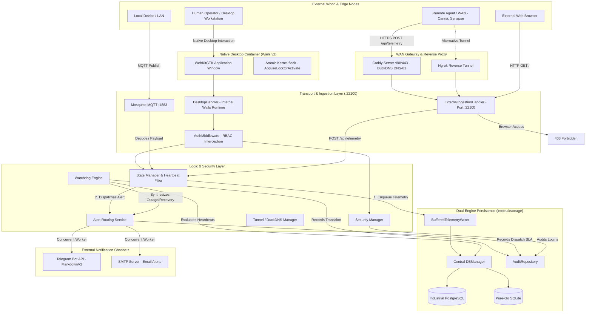
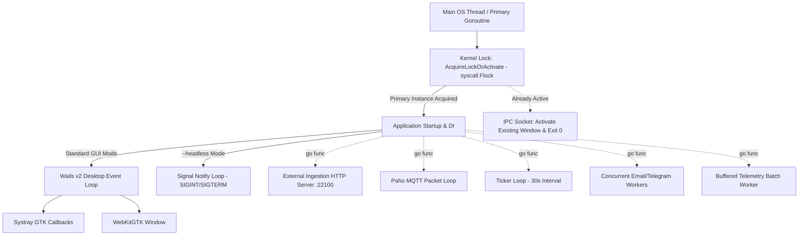

[📚 Documentation Hub](docs/INDEX.md) > **Detailed System Architecture**

---

# 🏗️ Detailed System Architecture: Noxfort Monitor™

This document provides an in-depth architectural overview of **Noxfort Monitor™ v2.0**. It is intended for software engineers, systems architects, and maintainers who need to understand the internal mechanics, **SOLID** patterns, concurrency models, and data flows of the system.

---

## 1. Macro Architectural Philosophy

Noxfort Monitor adheres to a strict **Event-Driven Architecture (EDA)** combined with **SOLID** principles and **Dependency Injection (DI)** assembled at the composition root in [`cmd/server/main.go`](cmd/server/main.go). The system eliminates shared global mutable state and packages with hidden initialization routines.

### System Layers:
1. **Transport Layer (`internal/transport`)**: Network protocol termination (Authenticated MQTT Broker via Paho with PBKDF2 credentials, public observability endpoints `/healthz`, `/api/health`, and `/metrics` Prometheus exporter, and segregated HTTP handlers: `ExternalIngestionHandler` strictly serving `POST /api/telemetry` with browser 403 blocking, and `DesktopHandler` serving full authenticated GUI routes inside Wails).
2. **Monitor Logic Layer (`internal/monitor`)**: The reactive "brain" (State Manager, Watchdog Engine, Alert Service, and Channel Tester).
3. **Security Layer (`internal/security`)**: Session management, cryptographic password hashing, token validation, Role-Based Access Control (RBAC), and boot-time environment security auditing (`ValidateEnvironmentSecurity`).
4. **Remote Access Layer (`internal/tunnel`)**: WAN telemetry ingestion powered by native DuckDNS dynamic updates, containerized Caddy reverse proxy (TLS/SSL ACME DNS-01 & WSS), and fallback Ngrok reverse tunneling.
5. **Domain Layer (`internal/domain`)**: Universal data structures and decoupled interface contracts.
6. **Persistence Layer (`internal/storage`)**: Dynamic dual-engine manager ([`DBManager`](docs/DATABASE.md)), non-blocking hot database snapshotting engine ([`BackupManager`](docs/DATABASE.md#9-automated-hot-backups--retention-strategy)), asynchronous `BufferedTelemetryWriter`, PostgreSQL and SQLite implementations, dialect adapter, and data migrator.
7. **Desktop Interface Layer (`internal/desktop`, `internal/tray`)**: Native runtime in Wails v2 with WebKitGTK and atomic kernel-level file lock (`syscall.Flock`) single-instance enforcement.

---

## 2. Core Subsystems in Detail

### 2.1 The State Manager (`internal/monitor/state.go`)
The `StateManager` is the central event routing hub. It receives decoded payloads from the transport layer (MQTT or HTTP REST) and applies a "Filter and Act" pipeline:
* **Heartbeat Filtering**: Every incoming message immediately updates the originating device's `last_seen` timestamp via `UpdateLastSeen`. The [`KeywordHeartbeatDetector`](internal/monitor/state.go) evaluates the message: if it is at the `INFO` level and contains keep-alive keywords ("*system ok*", "*heartbeat*", "*online*"), processing completes immediately, preventing redundant database writes and alert fatigue.
* **Incident Processing**: If the message represents a genuine operational incident, the `StateManager` persists the event to the telemetry repository and forwards it to the `AlertService`.

### 2.2 The Watchdog Engine (`internal/monitor/engine.go`)
While the State Manager processes active incoming events, the `Engine` is responsible for detecting **silent failures**:
* **Concurrency**: Runs in a dedicated goroutine driven by a `time.Ticker` with a default 30-second interval.
* **Presence Evaluation**: Compares the current timestamp against the `LastSeen` timestamp of each monitored device. If an enabled device fails to report for more than **5 minutes**, the [`SystemStatusTracker`](internal/monitor/tracker.go) flags the transition and synthesizes a `CRITICAL` `System OFFLINE` incident.
* **Recovery Detection**: When a previously offline device resumes transmitting, the Engine synthesizes an `INFO` recovery event and records the total downtime duration in the audit repository.

### 2.3 Intelligent Alert Routing (`internal/monitor/alerts.go`)
The `AlertService` decouples notification business logic from physical transmission through the [`NotificationChannel`](internal/monitor/channel.go) interface:
* **Role-Based Categorization (RBAC)**:
  * **Administrators**: Receive all global incidents.
  * **Technicians**: Receive only alerts in the `HARDWARE` category.
  * **Programmers**: Receive only alerts in the `SOFTWARE` category.
* **Severity Filtering**: Contacts can configure their profiles to exclusively receive `CRITICAL` alerts, suppressing `WARNING` notifications.
* **Asynchronous Dispatch**: Each notification to each recipient is dispatched in its own goroutine, ensuring that slow SMTP servers never block the MQTT broker or the Telegram API.
* **Delivery Auditing**: Every transmission attempt generates an [`AlertDispatchLog`](docs/AUDIT_TRAIL.md) entry with status `SENT` or `FAILED` along with the failure reason if applicable.

### 2.4 Security & Session Subsystem (`internal/security`)
* **Identity Management**: [`SecurityManager`](internal/security/security_manager.go) centralizes authentication, RBAC, and security auditing.
* **Cryptographic Tokens**: The [`SessionManager`](internal/security/session.go) issues secure in-memory tokens with sliding renewal and expiration.
* **Password Isolation**: Passwords are hashed with unique cryptographic salts and excluded from JSON serialization.

### 2.5 Remote Access & WAN Ingestion (`internal/tunnel`)
* The [`internal/tunnel`](docs/REMOTE_ACCESS.md) package abstracts remote WAN ingestion providers:
  * **DuckDNS Driver**: Active default driver for dynamic DNS record synchronization, IPv4/IPv6 address discovery, and live connection diagnostics. Works in concert with [Caddy](docs/CADDY_INTEGRATION.md) for automated TLS certificate issuance and HTTPS routing.
  * **Ngrok Driver**: Optional outbound reverse tunnel for deployments operating behind strict corporate firewalls or carrier-grade NAT (CGNAT) without port forwarding capability.

---

## 3. Domain Model and Core Entities (`internal/domain`)

The `internal/domain` package has zero external dependencies, serving as the pure core of the application:

* **`IncomingEvent`**: Universal telemetry payload containing `Category`, `Origin`, `Level`, `Message`, and `OccurredAt`.
* **`Device`**: Monitored node with its human-readable name, unique identifier, and `LastSeen` timestamp.
* **`Contact`**: Incident recipients with roles, notification channels (Email, Telegram Chat ID), and severity filters.
* **`User`**: System operators with credentials and assigned roles (`RoleAdmin`, `RoleOperator`).
* **`SecurityAuditLog`**, **`AlertDispatchLog`**, **`DeviceStateTransition`**: Compliance and audit trail models.
* **`DatabaseConfig`** and **`DatabaseStatus`**: Parameters and health state of the persistence layer.
* **`Settings`**: System configuration model, including SMTP, Telegram, DuckDNS, and Ngrok parameters.

---

## 4. Persistence Layer & Dual-Engine (`internal/storage`)

See the dedicated guide [Database & Persistence](docs/DATABASE.md).

* **Native Dual-Engine**:
  * **SQLite**: `modernc.org/sqlite` for embedded deployments without a C compiler (CGO-free).
  * **PostgreSQL**: `github.com/lib/pq` for industrial servers with schema isolation (`schema_monitor`).
* **Central DBManager**: Enables hot database switching via `ReloadableRepository.SetDB()` without restarting the process.
* **Buffered Ingestion Worker (`BufferedTelemetryWriter`)**: Asynchronous, channel-buffered telemetry writer that flushes events in batches (`internal/storage/buffered_telemetry_writer.go`), shielding databases from I/O spikes during high-throughput event storms.
* **Automatic Migrator**: Structured data synchronization across engines via `MigrateData()`, seamlessly copying devices, contacts, users, and settings (including DuckDNS and Ngrok parameters).
* **Query Adapter**: Runtime adaptation of SQL placeholders (`?` to `$1, $2`) and conflict clause resolution.

---

## 5. Threading Model, Concurrency & Operating System

* **Primary Goroutine & Atomic Lock**:
  * Enforces single-instance integrity via `desktop.AcquireLockOrActivate()`, obtaining an exclusive OS kernel file lock (`syscall.Flock`) on `$XDG_RUNTIME_DIR/noxfort-monitor.lock` (or `/tmp/noxfort-monitor-<uid>.lock`). If locked, sends an IPC activation command to `$XDG_RUNTIME_DIR/noxfort-monitor.sock` and terminates cleanly.
  * In desktop mode, executes `desktopApp.Run()` (Wails v2), because Linux GTK/WebKit components require the main OS thread.
  * In `--headless` mode, blocks on an OS signal channel (`syscall.SIGTERM`, `os.Interrupt`), executing as a background telemetry ingestion daemon.
* **Web Server**: Runs in an independent goroutine with 15-second timeouts. Restricts public routes exclusively to `POST /api/telemetry` while blocking browser requests with HTTP 403 Forbidden.
* **MQTT Listener**: The Paho client manages the TCP socket across dedicated read/write goroutines.
* **Watchdog Loop**: Operates on a decoupled `time.Ticker` channel.
* **Graceful Shutdown**: Coordinated by a thread-safe `sync.Once` routine that releases the kernel flock lock, closes the IPC listener, terminates the active tunnel/DuckDNS service, flushes the `BufferedTelemetryWriter`, shuts down the HTTP server, stops the Watchdog Engine, disconnects from MQTT, and releases database pools.

---

### 🔗 Related Documentation
* 🧭 [Documentation Hub](docs/INDEX.md) — Master documentation index
* 🗄️ [Database & Persistence](docs/DATABASE.md) — DBManager, PostgreSQL, and SQLite
* 🔐 [Security & RBAC](docs/SECURITY.md) — SecurityManager and Middleware details
* 🌐 [Remote Access & Tunneling](docs/REMOTE_ACCESS.md) — DuckDNS & Ngrok architecture
* 🛡️ [Caddy Reverse Proxy](docs/CADDY_INTEGRATION.md) — Automated HTTPS & WSS proxy
* 🖥️ [Desktop Application](docs/DESKTOP_APP.md) — Wails v2 runtime and Headless mode
* 🔍 [Audit Trail](docs/AUDIT_TRAIL.md) — Compliance and audit tracking model
* 📡 [API Reference](docs/API_REFERENCE.md) — REST and MQTT contracts
