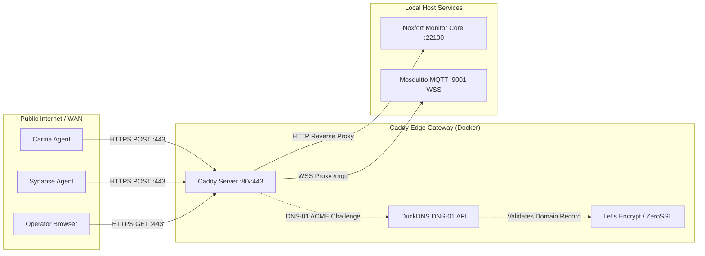

[📚 Documentation Hub](INDEX.md) > **Caddy Reverse Proxy & DuckDNS Integration**

---

# 🛡️ Caddy Reverse Proxy & DuckDNS (Automatic HTTPS): Noxfort Monitor™

This document outlines the architecture, deployment, and operational procedures for **Caddy Server** integrated with **DuckDNS** in **Noxfort Monitor™ v2.0**. This configuration provides enterprise-grade, automatic TLS/SSL termination via the **DNS-01 ACME challenge**, eliminating plaintext transmissions across the WAN and exposing standard ports (`80`, `443`, and `WSS`).

---

## 1. Architectural Overview

In industrial observability and telemetry networks, remote edge nodes (such as **Synapse**, **Carina**, or external sensors) dispatch telemetry over public networks. Exposing raw HTTP on non-standard ports (e.g., `:22100`) introduces security risks and frequently conflicts with corporate outbound firewalls.



### Key Advantages:
1. **Zero-Configuration HTTPS**: Caddy automatically requests and renews valid TLS certificates from Let's Encrypt / ZeroSSL.
2. **DNS-01 ACME Validation**: Unlike HTTP-01 challenges, DNS-01 does **not** require inbound port 80 to be open to issue or renew certificates. The challenge is fulfilled via outbound API calls to DuckDNS.
3. **Encrypted WebSockets (WSS)**: Enables secure MQTT-over-WebSockets for future web dashboards via `wss://your-domain.duckdns.org/mqtt`.
4. **Standard Web Ports**: Standardizes traffic on port 443, eliminating the need to specify `:22100` in URLs.

---

## 2. Directory Structure

The Caddy subsystem is contained within the `caddy/` directory:

```text
MONITOR_CORE/
├── caddy/
│   ├── Dockerfile         # Multi-stage build with github.com/caddy-dns/duckdns
│   └── Caddyfile          # Reverse proxy and TLS rules
├── docker-compose.yml     # Orchestration for Mosquitto and Caddy
└── .env                   # Credentials (DuckDNS token, domain, email)
```

---

## 3. Configuration & Setup

### 3.1 Configure Environment Variables (`.env`)
Copy `.env.example` to `.env` (if not already done) and configure your DuckDNS details:

```env
# DuckDNS Subdomain (e.g. 'my-monitor' for my-monitor.duckdns.org)
DUCKDNS_DOMAIN=your-subdomain

# DuckDNS Account API Token (from duckdns.org)
DUCKDNS_TOKEN=xxxxxxxx-xxxx-xxxx-xxxx-xxxxxxxxxxxx

# Email address for Let's Encrypt expiration notifications
ACME_EMAIL=admin@your-company.com

# Enable HTTPS telemetry URL formatting in Noxfort Monitor
MONITOR_USE_HTTPS=true
```

### 3.2 Build the Caddy Container
Compile the custom Caddy image equipped with the `caddy-dns/duckdns` plugin:

```bash
make caddy-build
```

### 3.3 Start the Edge Services
Start Mosquitto and Caddy in the background:

```bash
make services-start
```

To monitor live certificate issuance and reverse proxy logs:
```bash
make services-logs
```

To stop the services:
```bash
make services-stop
```

---

## 4. Router & Firewall Configuration (Port Forwarding)

For external devices on the internet to reach your Monitor:
1. Access your router's administration panel.
2. Configure **Port Forwarding (Virtual Server)**:
   - **Port 80 TCP** -> `<Local-IP-of-Monitor-Host>:80` (HTTP redirect)
   - **Port 443 TCP/UDP** -> `<Local-IP-of-Monitor-Host>:443` (HTTPS & HTTP/3 QUIC)
3. *(Optional)* If your ISP operates behind strict CGNAT without IPv4 forwarding, the system's native IPv6 support can be utilized if global IPv6 is assigned to your host.

---

## 5. Verification

### Test HTTPS Endpoint via cURL:
```bash
curl -I https://your-subdomain.duckdns.org
```

**Expected Response**:
```http
HTTP/2 403
server: Caddy
```

> [!NOTE]
> An **HTTP 403 Forbidden** response on root `GET` requests is the expected, intended security behavior: external web browser access to the dashboard is deactivated by design to confine administrative operations to the native desktop application. External ingestion via `POST /api/telemetry` responds with **HTTP 200 OK**.

### Transmit Telemetry over Secure HTTPS:
```bash
curl -X POST "https://your-subdomain.duckdns.org/api/telemetry" \
  -H "Content-Type: application/json" \
  -d '{
    "category": "HARDWARE",
    "origin": "edge-station-01",
    "level": "INFO",
    "message": "System OK - Telemetry over Secure HTTPS",
    "occurred_at": "2026-09-27T22:30:00Z"
  }'
```

---

## 6. Troubleshooting

| Symptom | Cause | Solution |
| :--- | :--- | :--- |
| `failed to obtain certificate` | Invalid DuckDNS token or domain | Verify `DUCKDNS_TOKEN` and `DUCKDNS_DOMAIN` in `.env`. Check `make services-logs`. |
| `connection refused` on 443 | Caddy container not running | Run `make services-start` and verify container status with `docker ps`. |
| `502 Bad Gateway` | Noxfort Monitor Core not running on host | Ensure `noxfort-monitor` is running (`make run` or `make run-headless`). |
| ACME challenge rate-limited | Too many failed requests | Caddy certificates persist in `caddy_data` volume to prevent duplicate issuances. |
