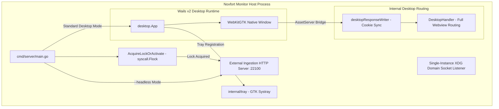

[📚 Documentation Hub](INDEX.md) > **Desktop Application & Operations**

---

# 🖥️ Desktop Application & Operations: Noxfort Monitor™

This document details the native desktop architecture of **Noxfort Monitor™ v2.0** built with **Wails v2**, its integration with **WebKitGTK**, the **Single-Instance** lock mechanism, the **System Tray (Systray)** lifecycle, **Headless** server mode, and the **Debian package (`.deb`)** generation pipeline.

---

## 1. Desktop Interface Overview

Noxfort Monitor combines the rapid iteration of web frontend technologies with the high performance and native integration of a compiled Go application. Rather than relying on resource-heavy browser runtimes (such as Chromium or Electron), the system leverages **Wails v2** with Linux-native **WebKitGTK**.


```mermaid
graph TD
    subgraph "Noxfort Monitor Host Process"
        Main[cmd/server/main.go]
        Lock[AcquireLockOrActivate - syscall.Flock]
        ExtHTTP[External Ingestion HTTP Server :22100]
        IPC[Single-Instance XDG Domain Socket Listener]
        Tray[internal/tray - GTK Systray]
        
        subgraph "Internal Desktop Routing"
            DesktopMux[DesktopHandler - Full Webview Routing]
            SessionBridge[desktopResponseWriter - Cookie Sync]
        end

        subgraph "Wails v2 Desktop Runtime"
            WailsApp[desktop.App]
            WebKit[WebKitGTK Native Window]
        end
    end

    Main --> Lock
    Lock -->|Lock Acquired| ExtHTTP
    Main -->|Standard Desktop Mode| WailsApp
    WailsApp --> WebKit
    WebKit -->|AssetServer Bridge| SessionBridge
    SessionBridge --> DesktopMux
    WailsApp -->|Tray Registration| Tray
    Main -->|--headless Mode| ExtHTTP
```

### Technical Specifications:
* **Default Dimensions**: 1280x800 px (minimum: 1024x600 px).
* **GPU Policy**: `linux.WebviewGpuPolicyOnDemand` for optimal energy efficiency on industrial workstations.
* **Minimize on Close**: `HideWindowOnClose: true`. Clicking the window close button ("X") does not terminate the backend server; it hides the GUI to the system tray.

---

## 2. Single-Instance Enforcement (Atomic Kernel Lock & IPC)

To guarantee database integrity and prevent network port collisions (`:1883`, `:22100`), Noxfort Monitor enforces a robust dual locking mechanism ([`internal/desktop/singleinstance.go`](../internal/desktop/singleinstance.go)):

1. **Atomic Kernel File Lock (`syscall.Flock`) via `AcquireLockOrActivate()`**:
   - The primary instance acquires an exclusive, non-blocking kernel lock (`LOCK_EX | LOCK_NB`) on a dedicated lock file:
     `$XDG_RUNTIME_DIR/noxfort-monitor.lock` (with automatic fallback to `/tmp/noxfort-monitor-<uid>.lock`).
   - If an instance is already active, `Flock` returns an error (`ErrAlreadyRunning`). The new process automatically delegates activation to `desktop.TryActivateExisting()` and exits immediately with code `0`.
2. **Unix Domain IPC Socket**:
   - The primary process listens on `$XDG_RUNTIME_DIR/noxfort-monitor.sock` (or `/tmp/noxfort-monitor-<uid>.sock`).
   - Subsequent process launches write an `ACTIVATE` command to this socket.
   - Upon receiving the command, the running instance restores its minimized or hidden window and brings it to the top of the desktop workspace via `desktopApp.RestoreWindow()`.
3. **Wails SingleInstanceLock**:
   - A complementary protection layer in the Wails runtime provides secondary protection across different desktop environments.

---

## 3. System Tray (Systray) Integration

The [`internal/tray/tray.go`](../internal/tray/tray.go) package integrates directly into the desktop event loop via `tray.Register()`:
* **Embedded Asset**: The official Noxfort icon is compiled into the Go binary via `//go:embed icon.png`.
* **Context Menu**:
  * **Open Dashboard**: Restores the graphical window and brings it to the top of the desktop workspace.
  * **Shutdown / Quit**: Triggers a clean graceful shutdown, stopping the Watchdog Engine, disconnecting from the MQTT broker, terminating the active WAN service (DuckDNS / Ngrok), and releasing database connections.

---

## 4. Headless Server Mode (Daemon)

On production servers, Docker containers, or cloud environments without an active display server (no X11 or Wayland), attempting to launch WebKit windows will result in an initialization error (`cannot open display`).

To run exclusively as a background daemon, supply the headless flag:

```bash
# Via compiled binary:
./bin/noxfort-monitor --headless

# Or using the alias:
./bin/noxfort-monitor --server-only

# Via Makefile:
make run-headless
```

### What Headless Mode Does:
1. **Disables GUI Initialization**: Bypasses Wails v2 and WebKitGTK window creation entirely.
2. **Disables IPC Activation Listener**: Skips GUI window restore socket listeners while maintaining system stability.
3. **Runs External Ingestion Listener**: Starts `ExternalIngestionHandler` on port `22100` solely for accepting IoT sensor data (`POST /api/telemetry`).
4. **Autonomous Operation**: Operates MQTT client subscriptions, silent failure detection (Watchdog Engine), DuckDNS dynamic DNS updates, and automated email/Telegram alert dispatching.
5. **Security Isolation**: Direct browser access to dashboard HTML pages is blocked with HTTP 403 Forbidden. Headless nodes operate purely as telemetry collectors and incident alert dispatchers.
6. **Graceful Shutdown**: Listens for standard OS termination signals (`SIGINT`, `SIGTERM`) to release locks and cleanly terminate.

---

## 5. Debian Packaging (`.deb`)

The repository includes automated scripts to package releases for Ubuntu / Debian via [`build_installer.sh`](../build_installer.sh) or the Makefile:

```bash
make deb
```

### What the Installer Bundles:
1. **Optimized Build**: Compiles the binary with `-tags "production,webkit2_41"` and `-ldflags="-s -w"` (stripping debug symbols to reduce binary size).
2. **Multi-Resolution Icons**: Installs hicolor icons from 16x16 up to 512x512 into `/usr/share/icons/hicolor/`.
3. **Installation in `/opt`**: Copies the binary and web templates into `/opt/noxfort-monitor/`.
4. **Symlink Generation**: Links `/usr/local/bin/noxfort-monitor`.
5. **Desktop Menu Integration**: Installs `noxfort-monitor.desktop` into GNOME/KDE application menus.
6. **Autostart on Login**: Places an entry in `/etc/xdg/autostart/` for automated startup upon user logon.
7. **Declared System Dependencies**:
   ```control
   Depends: mosquitto, libayatana-appindicator3-1 | libappindicator3-1, libwebkit2gtk-4.1-0 | libwebkit2gtk-4.0-37, libgtk-3-0
   ```
8. **Post-Installation Scripts**: Enables and starts the `mosquitto` systemd service automatically.

---

### 🔗 Related Documentation
* 🏗️ [System Architecture](../ARCHITECTURE.md) — Concurrency model and startup flow
* 🚀 [Deployment Guide](DEPLOYMENT.md) — Headless systemd service configuration
* 👨‍💻 [Developer Guide](DEVELOPER_GUIDES.md) — C/GTK compilation dependencies
* 🔐 [Security & Sessions](SECURITY.md) — Webview cookie synchronization
* 🌐 [Remote Access](REMOTE_ACCESS.md) — Ngrok tunnel integration with the UI
