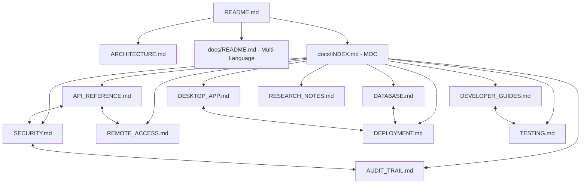

# 📚 Noxfort Monitor™ Technical Master Documentation Hub

Welcome to the **Noxfort Monitor™ v2.0** technical documentation library. Designed as an industrial event-driven observability, telemetry ingestion, and incident response platform, Noxfort Monitor bridges high-frequency MQTT/HTTP sensor streams, silent failure detection via Watchdog, automated multi-channel alert dispatching, and dual-engine persistence (PostgreSQL and SQLite).

This master documentation index provides deep technical coverage for software engineers, devops operators, field technicians, and system integrators. It is fully compatible with both **GitHub** and **[Obsidian](https://obsidian.md/)**.

---

## 🗺️ Codebase Map & Directory Hierarchy

```text
MONITOR_CORE/
├── caddy/                          # Automated TLS edge gateway (Docker)
│   ├── Dockerfile                  # Multi-stage Caddy build with caddy-dns/duckdns plugin
│   └── Caddyfile                   # Automatic HTTPS reverse proxy & WSS forwarder
├── cmd/
│   └── server/
│       └── main.go                 # Composition root, dependency injection & lifecycle bootstrap
├── internal/
│   ├── desktop/                    # Native desktop application (Wails v2 runtime & single-instance lock)
│   │   ├── app.go                  # Wails application bindings, lifecycle events & window control
│   │   ├── singleinstance.go       # Atomic kernel flock (syscall.Flock) & Unix IPC socket listener
│   │   └── response_writer.go      # Custom Wails AssetServer HTTP response writer & cookie bridge
│   ├── domain/                     # Pure domain models (zero external dependencies)
│   │   ├── audit.go                # SecurityAuditLog, AlertDispatchLog, DeviceStateTransition models
│   │   ├── contact.go              # Contact notification recipient & role definitions
│   │   ├── database.go             # DatabaseConfig & DatabaseStatus models
│   │   ├── device.go               # Device entity & LastSeen tracker
│   │   ├── event.go                # Universal IncomingEvent telemetry payload
│   │   ├── settings.go             # Application settings & environment options
│   │   └── user.go                 # System user & RoleAdmin/RoleOperator definitions
│   ├── monitor/                    # Reactive business logic engine
│   │   ├── alerts.go               # Role-based alert dispatcher (RBAC filtering)
│   │   ├── channel.go              # NotificationChannel interface (SMTP & Telegram Bot)
│   │   ├── engine.go               # Watchdog engine for silent failure & recovery detection
│   │   ├── state.go                # StateManager event routing & smart heartbeat filter
│   │   ├── tester.go               # On-demand notification channel diagnostics
│   │   └── tracker.go              # SystemStatusTracker device health state machine
│   ├── protocol/                   # MQTT protocol definitions & packet handlers
│   ├── security/                   # Authentication & security subsystem
│   │   ├── hasher.go               # Cryptographic salted password hashing
│   │   ├── security_manager.go     # Central security coordinator & login auditor
│   │   └── session.go              # Thread-safe in-memory session manager with sliding renewal
│   ├── storage/                    # Persistence tier & dual-engine database subsystem
│   │   ├── audit_repo.go           # AuditRepository implementation (PostgreSQL & SQLite)
│   │   ├── buffered_telemetry_writer.go # In-memory batch ingestion queue & worker
│   │   ├── contact_repo.go         # ContactRepository implementation
│   │   ├── database.go             # Central connection manager, SQLite init & interfaces
│   │   ├── db_config_store.go      # Database configuration persistence
│   │   ├── db_manager.go           # Dynamic DBManager for live connection hot-reloading
│   │   ├── device_repo.go          # DeviceRepository implementation
│   │   ├── migrator.go             # Heterogeneous zero-downtime data migrator (MigrateData)
│   │   ├── postgres_schema.go      # PostgreSQL DDL schema & table provisioning
│   │   ├── query_adapter.go        # SQL dialect adapter (? vs $1, $2, ON CONFLICT)
│   │   ├── settings_repo.go        # SettingsRepository implementation
│   │   ├── telemetry_repo.go       # TelemetryRepository implementation
│   │   └── user_repo.go            # UserRepository implementation
│   ├── transport/                  # Network transport adapters
│   │   ├── http/                   # HTTP REST server, routes, handlers & middleware
│   │   │   ├── auth_handler.go     # Login, logout & authentication API routes
│   │   │   ├── database_handler.go # Database testing, migration & hot-reload API
│   │   │   ├── device_handler.go   # Device registration & listing API
│   │   │   ├── middleware.go       # AuthMiddleware for cookie & token RBAC interception
│   │   │   ├── routes.go           # Full DesktopHandler routing tree for native desktop container
│   │   │   ├── server.go           # ExternalIngestionHandler (POST /api/telemetry only) & server lifecycle
│   │   │   ├── settings_handler.go # System settings & channel test endpoints
│   │   │   ├── tunnel_handler.go   # DuckDNS & Ngrok management endpoints (/disconnect, /test)
│   │   │   └── user_handler.go     # User account management API
│   │   └── mqtt/                   # Paho MQTT client & async subscription loops
│   ├── tray/                       # Native Linux desktop system tray (Systray)
│   └── tunnel/                     # WAN reverse tunnel subsystem (DuckDNS / Ngrok)
│       ├── driver.go               # Driver, Status, Service and Tester interface definitions
│       ├── duckdns_driver.go       # Native DuckDNS dynamic IP updater & HTTPS URL builder
│       ├── duckdns_diagnostics.go  # Live DNS resolution & IPv6 discovery diagnostics
│       ├── duckdns_util.go         # Domain & token sanitization helpers
│       ├── manager.go              # Tunnel/DuckDNS lifecycle manager
│       └── ngrok_driver.go         # Outbound Ngrok reverse tunnel process driver
├── configs/
│   └── config.yaml                 # Static system configuration fallback
├── docs/                           # Comprehensive Knowledge Vault & Technical Guides
│   ├── README.md                   # Multi-Language Documentation Hub
│   ├── index.md                    # MkDocs Portal & Summary
│   ├── INDEX.md                    # Master Map of Content (MOC)
│   ├── API_REFERENCE.md            # Complete API & Protocol Reference
│   ├── ARCHITECTURE.md             # Detailed System Architecture (EDA & Goroutines)
│   ├── AUDIT_TRAIL.md              # Triple Audit Trail & Compliance
│   ├── DATABASE.md                 # Dual-Engine Persistence & Hot-Reload
│   ├── DEPLOYMENT.md               # Production Deployment & Systemd
│   ├── DESKTOP_APP.md              # Wails v2 Desktop GUI & Headless Mode
│   ├── DEVELOPER_GUIDES.md         # Developer & Contributor Guide
│   ├── REMOTE_ACCESS.md            # WAN Telemetry Ingestion & Ngrok
│   ├── RESEARCH_NOTES.md           # Architectural Decisions & Roadmap
│   ├── SECURITY.md                 # Security, RBAC & Authentication
│   ├── TESTING.md                  # Unit Testing & QA Verification
│   ├── assets/                     # Logos & diagrams (monitor-logo.png, noxfort-logo.png)
│   ├── stylesheets/                # Custom CSS for MkDocs Material (extra.css)
│   ├── en/                         # Canonical English Documentation Suite
│   ├── pt-br/                      # Suíte de Documentação em Português do Brasil
│   ├── es/                         # Suite de Documentación en Español
│   ├── fr/                         # Suite de Documentation en Français
│   ├── ru/                         # Комплект технической документации на Русском
│   └── zh/                         # 简体中文工业技术文档套件
├── web/                            # Frontend assets & HTML templates
│   ├── static/                     # CSS, JavaScript & Static images
│   └── templates/                  # Go html/template views (Dashboard, Audit, Remote, Server)
├── Makefile                        # Build, test, run, and packaging automation
├── build_installer.sh              # Debian installer build pipeline
└── wails.json                      # Wails v2 project configuration
```

---

## 🧭 Content Map (Knowledge Graph / MOC)


```mermaid
graph TD
    Root[README.md] --> Arch[ARCHITECTURE.md]
    Root --> Hub[docs/README.md - Multi-Language]
    Root --> Index[docs/INDEX.md - MOC]
    
    Index --> Proto[API_REFERENCE.md]
    Index --> DB[DATABASE.md]
    Index --> Sec[SECURITY.md]
    Index --> Remote[REMOTE_ACCESS.md]
    Index --> Desktop[DESKTOP_APP.md]
    Index --> Audit[AUDIT_TRAIL.md]
    Index --> Deploy[DEPLOYMENT.md]
    Index --> Dev[DEVELOPER_GUIDES.md]
    Index --> Test[TESTING.md]
    Index --> Res[RESEARCH_NOTES.md]
    
    Proto <--> Remote
    Proto <--> Sec
    DB <--> Deploy
    Sec <--> Audit
    Desktop <--> Deploy
    Dev <--> Test
```

---

## 🗂️ Technical Guides Directory

### 1. Core & Architecture
* 🏗️ **[System Architecture](../ARCHITECTURE.md)**: Macro view of the Event-Driven Architecture (EDA), dependency injection in `cmd/server/main.go`, goroutine concurrency model, and SOLID layers.
* 📖 **[Project Overview (README)](../README.md)**: Executive summary, key features, multi-language switcher, quickstart setup, and AGPL v3 licensing.
* 🌐 **[Multi-Language Documentation Hub](README.md)**: Cross-language matrix linking guides in English, Portuguese, Spanish, French, Russian, and Mandarin.
* 🤝 **[Contributing Guide](../CONTRIBUTING.md)**: Go code standards, pull request workflow, and architectural rules.

### 2. Protocols & External Integration
* 📡 **[Complete API & Protocol Reference](API_REFERENCE.md)**:
  * MQTT ingestion via the native broker on `tcp://127.0.0.1:1883`.
  * HTTP REST ingestion via `POST /api/telemetry` on port `22100`.
  * Routes for Authentication, Users, Tunnel, Database, and Audit.
* 🌐 **[Remote Access & WAN Ingestion](REMOTE_ACCESS.md)**:
  * Dynamic DNS synchronization via DuckDNS, IPv6 discovery, and status diagnostics.
  * Reverse tunnel architecture via Ngrok for strict industrial firewalls and CGNAT.
  * Public WAN ingestion endpoints for remote agents (Carina, Synapse, edge nodes).
  * Automated boot activation and on-demand connection testing (`/api/tunnel/test`).
* 🛡️ **[Caddy Reverse Proxy & DuckDNS](CADDY_INTEGRATION.md)**:
  * Automated TLS/SSL termination with DuckDNS DNS-01 ACME challenge.
  * Encrypted MQTT-over-WebSockets (WSS) and unified port 443 routing.

### 3. Persistence & Storage
* 🗄️ **[Database & Dual-Engine Persistence](DATABASE.md)**:
  * Coexistence and dynamic runtime switching between **PostgreSQL** and **SQLite**.
  * Live repository hot-reloading via `DBManager` without dropping connections.
  * Automatic heterogeneous data migrator (`MigrateData`).
  * Secure schema and user provisioning in PostgreSQL.
  * Runtime SQL dialect adapter (`QueryAdapter`).

### 4. Security & Governance
* 🔐 **[Security, Authentication & RBAC](SECURITY.md)**:
  * Access roles (`RoleAdmin` vs `RoleOperator`).
  * Session cookie lifecycle for `noxfort_session` and header-based token support.
  * Salted password hashing.
  * Idempotent superuser bootstrapping at boot via environment variables.
  * `AuthMiddleware` and smart interception (303 redirect vs 401 Unauthorized).
* 🔍 **[Audit Trail & Observability](AUDIT_TRAIL.md)**:
  * Security access traceability (`SecurityAuditLog`).
  * Alert delivery verification and SLA tracking (`AlertDispatchLog`).
  * Availability monitoring and downtime calculation (`DeviceStateTransition`).

### 5. Desktop Application & Packaging
* 🖥️ **[Desktop Application & Operations](DESKTOP_APP.md)**:
  * Wails v2 + WebKitGTK architecture for Linux.
  * Single-instance lock via Unix IPC socket (`desktop.TryActivateExisting`).
  * System tray (`internal/tray`), minimize-on-close, and graceful shutdown.
  * **Headless** server mode (`--headless` / `--server-only`) for screenless environments.
  * Packaging and distribution via Debian installer (`.deb`).

### 6. Engineering, Testing & Operations
* 🚀 **[Production Deployment Guide](DEPLOYMENT.md)**:
  * Systemd service configured in headless mode.
  * Direct installation via `.deb` package.
  * NGINX reverse proxy configuration with SSL termination (port 22100).
* 👨‍💻 **[Developer Guide](DEVELOPER_GUIDES.md)**:
  * Local environment configuration (Go 1.22+, `libwebkit2gtk-4.1-dev`).
  * Dependency injection, channel extensions, and adding new entities.
* 🧪 **[Testing & Quality Assurance (QA)](TESTING.md)**:
  * Running unit tests with repository mocks.
  * Manual E2E testing with `mosquitto_pub` and `curl`.
  * Notification channel diagnostics (SMTP and Telegram).
* 🔬 **[Research Notes & Technical Decisions](RESEARCH_NOTES.md)**:
  * Decision log: CGO elimination, migration to Wails v2, and future clustering with gRPC.

---

### 🔗 Navigation Tips
* **On GitHub**: All links above use standard relative paths and work seamlessly in the web interface.
* **In Obsidian**: This `docs/` folder can be opened as a vault or viewed as a notes folder; the Graph View will reveal the full interconnection of the ecosystem.

---

<div align="center">
  <br/>
  <b>Noxfort Systems</b> — <i>A State Of Art Company</i><br/>
  <i>Industrial Telemetry & Observability • Noxfort Monitor™ Server v2.0</i>
</div>
