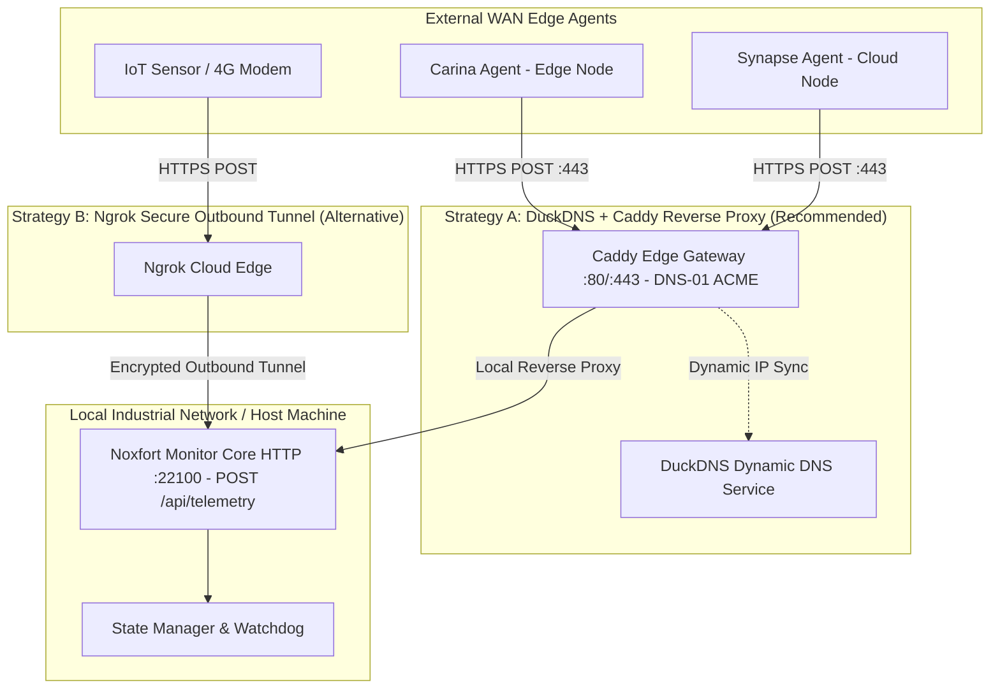

[📚 Documentation Hub](INDEX.md) > **Remote Access & WAN Ingestion**

---

# 🌐 Remote Access & WAN Ingestion (DuckDNS & Ngrok): Noxfort Monitor™

This document details the wide-area network (WAN) architecture of **Noxfort Monitor™ v2.0**, covering dynamic DNS updates via **DuckDNS**, automated HTTPS termination with **Caddy Server**, fallback reverse tunneling powered by **Ngrok**, and reliable public internet telemetry ingestion from remote edge agents (such as **Synapse**, **Carina**, or external IoT nodes).

---

## 1. Remote Ingestion Architecture in Industrial Environments

In industrial and distributed telemetry deployments, the central Monitor server frequently operates inside a local area network (LAN), behind NAT routers, cellular carrier CGNAT, or strict enterprise firewalls.

Noxfort Monitor provides a dual WAN connectivity strategy:


```mermaid
graph TD
    subgraph "External WAN Edge Agents"
        Carina[Carina Agent - Edge Node]
        Synapse[Synapse Agent - Cloud Node]
        Sensor[IoT Sensor / 4G Modem]
    end

    subgraph "Strategy A: DuckDNS + Caddy Reverse Proxy (Recommended)"
        DuckDNS[DuckDNS Dynamic DNS Service]
        Caddy[Caddy Edge Gateway :80/:443 - DNS-01 ACME]
    end

    subgraph "Strategy B: Ngrok Secure Outbound Tunnel (Alternative)"
        NgrokEdge[Ngrok Cloud Edge]
    end

    subgraph "Local Industrial Network / Host Machine"
        ExtHTTP[Noxfort Monitor Core HTTP :22100 - POST /api/telemetry]
        StateManager[State Manager & Watchdog]
    end

    Carina -->|HTTPS POST :443| Caddy
    Synapse -->|HTTPS POST :443| Caddy
    Sensor -->|HTTPS POST| NgrokEdge

    Caddy -.->|Dynamic IP Sync| DuckDNS
    Caddy -->|Local Reverse Proxy| ExtHTTP
    NgrokEdge -->|Encrypted Outbound Tunnel| ExtHTTP
    ExtHTTP --> StateManager
```

### Strategy Comparison:
1. **DuckDNS + Caddy (Primary / Recommended)**:
   - Updates your custom subdomain (`your-subdomain.duckdns.org`) with your host machine's public IPv4/IPv6.
   - [Caddy](CADDY_INTEGRATION.md) automatically handles Let's Encrypt / ZeroSSL certificate issuance via **DNS-01 ACME challenge** without requiring open port 80.
   - Standardizes external traffic on ports **80**, **443** (HTTPS), and exposes encrypted WebSockets (`/mqtt`) for Mosquitto.
2. **Ngrok Tunnel (Alternative / Zero-Forwarding)**:
   - Establishes an encrypted outbound TLS tunnel to the Ngrok cloud.
   - Ideal for networks behind strict carrier-grade NAT (CGNAT) where router port forwarding is completely prohibited.

---

## 2. The Decoupled Tunnel Subsystem (`internal/tunnel`)

Adhering to the Dependency Inversion Principle (**DIP**), the server does not hardcode WAN providers, but rather interacts with decoupled interfaces ([`internal/tunnel/driver.go`](../internal/tunnel/driver.go)):

```go
type Driver interface {
    Name() string
    IsAvailable() bool
    Start(ctx context.Context, cfg Config) error
    Stop() error
    Wait() error
}

type Tester interface {
    Test(ctx context.Context, token, domain string) (*TestResult, error)
}

type Service interface {
    Start(authToken, domain string) error
    Stop() error
    GetStatus() Status
    IsBinaryAvailable() bool
    TestConnection(ctx context.Context, token, domain string) (*TestResult, error)
}
```

### Core Subsystem Components:
1. **`DuckDNSDriver` ([`duckdns_driver.go`](../internal/tunnel/duckdns_driver.go))**:
   - Updates DuckDNS records dynamically via standard HTTP requests: `https://www.duckdns.org/update?domains={domain}&token={token}&ip={ip}`.
   - Discovers public IPv6 addresses via OS network interfaces.
   - Implements the `Tester` interface ([`duckdns_diagnostics.go`](../internal/tunnel/duckdns_diagnostics.go)) to perform active DNS lookups and validate credentials on demand.
2. **`NgrokDriver` ([`ngrok_driver.go`](../internal/tunnel/ngrok_driver.go))**:
   - Manages the native `ngrok` executable lifecycle (`ngrok http 22100`).
   - Polls the local Ngrok client API (`http://127.0.0.1:4040/api/tunnels`) to extract public HTTPS URLs.
3. **`Manager` ([`manager.go`](../internal/tunnel/manager.go))**:
   - Central state coordinator maintaining thread-safe operational status in memory.
   - Automatically constructs the unified telemetry ingestion endpoint: `https://your-domain.duckdns.org/api/telemetry`.
4. **`TunnelHandler` ([`tunnel_handler.go`](../internal/transport/http/tunnel_handler.go))**:
   - Serves the `/remote` operator view and JSON management APIs.

---

## 3. Configuration & Persistence

All WAN settings are persisted in the `settings` table of the active database ([`domain.Settings`](../internal/domain/settings.go)):

| Parameter | Database Column | Description |
| :--- | :--- | :--- |
| **DuckDNS Token** | `duckdns_token` | Account token from [duckdns.org](https://www.duckdns.org). |
| **DuckDNS Domain** | `duckdns_domain` | Registered subdomain (e.g., `noxfort-monitor`). |
| **DuckDNS Auto-Start** | `duckdns_enabled` | Auto-updates DuckDNS when the server boots. |
| **Ngrok Token** | `ngrok_auth_token` | Personal token obtained from the Ngrok dashboard. |
| **Ngrok Domain** | `ngrok_domain` | Reserved domain (e.g., `your-name.ngrok-free.app`). |
| **Ngrok Auto-Start** | `ngrok_enabled` | Auto-starts Ngrok tunnel when the server boots. |

### 3.1 Automatic Startup at Boot
During application bootstrap ([`cmd/server/main.go`](../cmd/server/main.go)), the server checks:
```go
activeToken := settings.DuckDNSToken
activeDomain := settings.DuckDNSDomain
activeEnabled := settings.DuckDNSEnabled

if activeToken != "" && activeDomain != "" && activeEnabled && !strings.Contains(activeDomain, "ngrok") {
    log.Printf("[BOOT] Auto-starting DuckDNS updater on domain '%s'...", activeDomain)
    if err := tunnelManager.Start(activeToken, activeDomain); err != nil {
        log.Printf("[WARN] Failed to auto-start DuckDNS updater on boot: %v", err)
    }
}
```

---

## 4. Integration with Edge Nodes (Carina, Synapse, IoT)

When the remote access service is active, the Monitor UI automatically updates:
1. In the **Monitored Systems** view (`/devices`), suggested ingestion commands adapt from LAN addresses (`192.168.x.x`) to the public HTTPS URL.
2. The **"Copy Address"** button copies the full endpoint ready for client environment variables.

### Remote Ingestion Example via cURL (DuckDNS / Caddy)
Remote edge nodes post events over HTTPS to standard port 443:

```bash
curl -X POST "https://your-domain.duckdns.org/api/telemetry" \
  -H "Content-Type: application/json" \
  -d '{
    "category": "HARDWARE",
    "origin": "carina-station-03",
    "level": "INFO",
    "message": "System OK - Telemetry over Secure WAN",
    "occurred_at": "2026-09-28T01:30:00Z"
  }'
```

**Server Response (`200 OK`)**:
```json
{
  "status": "received"
}
```

---

## 5. Remote Access & Tunnel Control Endpoints

All administrative tunnel operations require an authenticated session:

| Method | Endpoint | Privilege | Description |
| :--- | :--- | :--- | :--- |
| `GET` | `/remote` | Operator / Admin | Graphical desktop UI for managing WAN connectivity and credentials. |
| `GET` | `/api/tunnel/status` | Authenticated | Returns real-time health, provider name, and public telemetry URL. |
| `POST` | `/api/tunnel/save` | Admin | Persists DuckDNS credentials and updates active configuration. |
| `POST` | `/api/tunnel/start` | Admin | Manually triggers dynamic DNS update or launches tunnel. |
| `POST` | `/api/tunnel/stop` | Admin | Stops active WAN updates and disables auto-start on boot. |
| `POST` | `/api/tunnel/disconnect` | Admin | Completely unlinks credentials from the database and terminates service. |
| `POST` | `/api/tunnel/test` | Admin | Performs on-demand validation of DuckDNS token and domain DNS resolution. |

### 5.1 Real-Time Status Payload Schema (`GET /api/tunnel/status`)
```json
{
  "state": "ONLINE",
  "provider": "DuckDNS",
  "public_url": "https://noxfort-monitor.duckdns.org",
  "telemetry_url": "https://noxfort-monitor.duckdns.org/api/telemetry",
  "domain": "noxfort-monitor",
  "binary_found": true,
  "ipv6_address": "2804:14d:...",
  "local_port": "22100",
  "use_https": true,
  "error_message": "",
  "started_at": "01:30:00 28/09/2026"
}
```

### 5.2 Test Connectivity Payload Schema (`POST /api/tunnel/test`)
```json
{
  "success": true,
  "message": "Conexão DuckDNS validada com sucesso! Resolução DNS ativa.",
  "domain": "noxfort-monitor.duckdns.org",
  "resolved_ips": ["177.136.20.10"],
  "ipv6_active": true
}
```

---

### 🔗 Related Documentation
* 🛡️ [Caddy Reverse Proxy & DuckDNS](CADDY_INTEGRATION.md) — Automatic HTTPS & TLS reverse proxy deployment
* 🏗️ [System Architecture](../ARCHITECTURE.md) — Telemetry ingress pipeline and Concurrency model
* 📡 [API Reference](API_REFERENCE.md) — Detailed specification of `POST /api/telemetry`
* 🗄️ [Database & Persistence](DATABASE.md) — Structure of the `settings` table and migrations
* 🔐 [Security & RBAC](SECURITY.md) — Protection of administrative configuration endpoints
* 🖥️ [Desktop Application](DESKTOP_APP.md) — Desktop operations and single-instance lock
