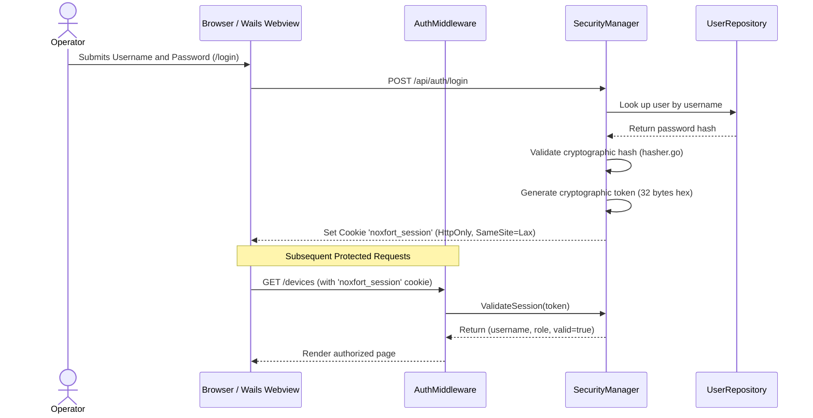
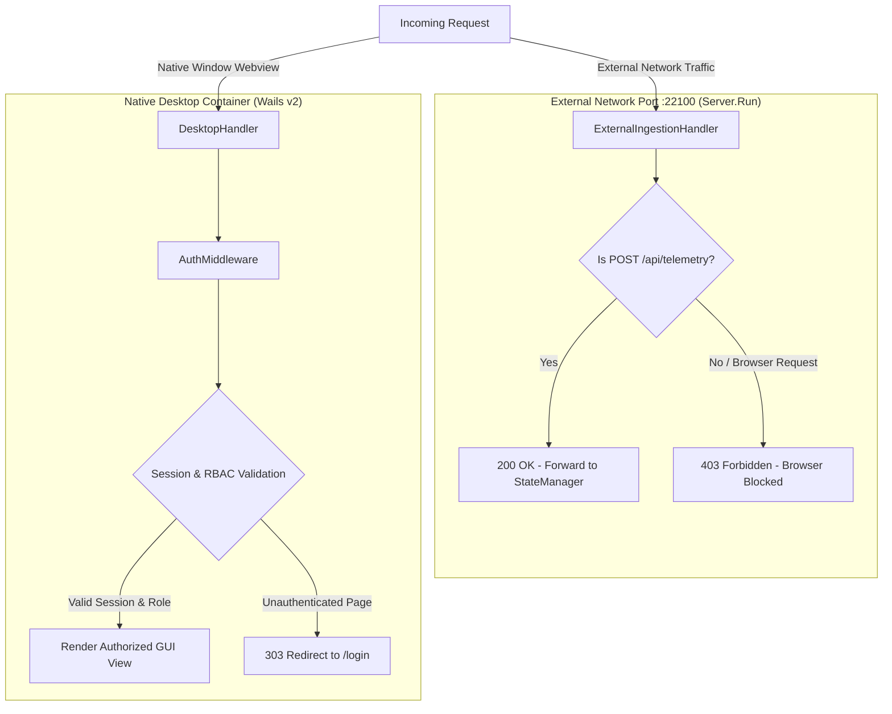

[📚 Documentation Hub](INDEX.md) > **Security, Authentication & RBAC**

---

# 🔐 Security, Authentication & RBAC: Noxfort Monitor™

This document details the security architecture, operator authentication, Role-Based Access Control (**RBAC**), session management, and superuser bootstrap mechanisms in **Noxfort Monitor™ v2.0**.

---

## 1. Access Control Model (RBAC)

Noxfort Monitor enforces strict access control to ensure that only authorized personnel can alter alert routing, register devices, or modify persistence layers.

### Available Roles ([`internal/domain/user.go`](../internal/domain/user.go))

| Role | Identifier | Permissions and Scope |
| :--- | :--- | :--- |
| **Administrator** | `ADMIN` | **Full Access**. Manages users, global settings (SMTP, Telegram, Ngrok), database switching and data migration, audit trail inspection, and device deletion. |
| **Operator** | `OPERATOR` | **Operational Access**. Views real-time dashboards, manages devices, and incident contacts, without permissions to change database credentials or create other administrators. |

---

## 2. Session Lifecycle & Authentication

Authentication is orchestrated by [`SecurityManager`](../internal/security/security_manager.go) and [`SessionManager`](../internal/security/session.go):


```mermaid
sequenceDiagram
    actor Operator
    participant Web as Browser / Wails Webview
    participant MW as AuthMiddleware
    participant Sec as SecurityManager
    participant DB as UserRepository

    Operator->>Web: Submits Username and Password (/login)
    Web->>Sec: POST /api/auth/login
    Sec->>DB: Look up user by username
    DB-->>Sec: Return password hash
    Sec->>Sec: Validate cryptographic hash (hasher.go)
    Sec->>Sec: Generate cryptographic token (32 bytes hex)
    Sec-->>Web: Set Cookie 'noxfort_session' (HttpOnly, SameSite=Lax)
    
    Note over Web,MW: Subsequent Protected Requests
    Web->>MW: GET /devices (with 'noxfort_session' cookie)
    MW->>Sec: ValidateSession(token)
    Sec-->>MW: Return (username, role, valid=true)
    MW-->>Web: Render authorized page
```

### 2.1 Token Storage & Transmission
* **Secure Cookie**: The session token is transported via the `noxfort_session` cookie, configured with `HttpOnly: true`, `Path: "/"`, and `SameSite: Lax`.
* **Header Support**: Programmatic APIs and integrations can transmit the token via standard HTTP headers:
  ```http
  Authorization: Bearer <session_token>
  ```
  or via the custom header `X-Session-Token: <session_token>`.
* **Desktop Synchronization (Wails)**: In Linux WebKitGTK environments where requests over custom URI schemes (`wails://`) may not persist native browser cookies automatically, [`desktopResponseWriter`](../internal/desktop/app.go) intercepts `Set-Cookie` response headers and synchronizes the token directly into desktop application memory.

---

## 3. Cryptography & Password Storage

The [`internal/security/hasher.go`](../internal/security/hasher.go) module encapsulates cryptographic key derivation:
* **Random Cryptographic Salt**: Every password generated receives an exclusive salt via `crypto/rand`.
* **Protected Storage**: The resulting hash stores algorithm identifiers, cost, salt, and final hash encoded in secure Base64.
* **Serialization Safety**: The [`domain.User`](../internal/domain/user.go) entity defines `json:"-"` on the `PasswordHash` field, guaranteeing password hashes are **never exposed** in any API JSON responses.

---

## 4. Automatic Superuser Bootstrapping (`EnsureSuperuser`)

To streamline initial deployments without compromising security, the system executes idempotent administrative account bootstrapping at startup ([`internal/security/superuser.go`](../internal/security/superuser.go)):

1. The system inspects environment variables:
   * `MONITOR_ADMIN_USER` (development default: `admin`)
   * `MONITOR_ADMIN_PASSWORD` (development default: `admin`)
2. If no administrative account exists in the active database (SQLite or PostgreSQL), the account is provisioned automatically with role `ADMIN`.
3. If administrators already exist in the database, the system will not overwrite existing credentials unless explicitly configured.

> [!WARNING]
> **Production Notice**: In production environments, copy `.env.example` to `.env` and configure strong credentials prior to exposing the server to the network.

---

## 5. Network Segregation & Protection Middleware

To maximize security and eliminate attack surfaces on external networks, Noxfort Monitor implements a strict **two-tier handler architecture**:


```mermaid
graph TD
    Client[Incoming Request]
    
    subgraph "External Network Port :22100 (Server.Run)"
        Ext[ExternalIngestionHandler]
        TelCheck{Is POST /api/telemetry?}
        AllowTel[200 OK - Forward to StateManager]
        DenyExt[403 Forbidden - Browser Blocked]
    end

    subgraph "Native Desktop Container (Wails v2)"
        DesktopMux[DesktopHandler]
        AuthMW[AuthMiddleware]
        RBAC{Session & RBAC Validation}
        AllowInternal[Render Authorized GUI View]
        RedirectLogin[303 Redirect to /login]
    end

    Client -->|External Network Traffic| Ext
    Ext --> TelCheck
    TelCheck -->|Yes| AllowTel
    TelCheck -->|No / Browser Request| DenyExt

    Client -->|Native Window Webview| DesktopMux
    DesktopMux --> AuthMW
    AuthMW --> RBAC
    RBAC -->|Valid Session & Role| AllowInternal
    RBAC -->|Unauthenticated Page| RedirectLogin
```

### 5.1 External Port Ingestion Handler (`ExternalIngestionHandler`)
Configured on the network listening socket in [`internal/transport/http/server.go`](../internal/transport/http/server.go):
1. **Public IoT Endpoint**: Strictly permits `POST /api/telemetry` without credentials to facilitate unhindered ingestion from autonomous edge nodes (Carina, Synapse, 4G sensors).
2. **Browser UI Blocking**: Any request attempting to access dashboard, settings, or administrative routes over external ports is immediately terminated with **HTTP 403 Forbidden** (returning a user-friendly restricted screen for browsers and JSON error for APIs). Direct browser access to the server UI is completely disabled by design.

### 5.2 Internal Desktop Handler & RBAC (`DesktopHandler`)
Configured in [`internal/transport/http/routes.go`](../internal/transport/http/routes.go) and mounted exclusively into the native Wails application:
1. **Exempt Public Routes**:
   * Static assets: `/static/*`
   * Authentication endpoints: `/login`, `/register`, `/api/auth/login`, `/api/auth/status`
   * Telemetry ingestion: `POST /api/telemetry`
2. **Unauthenticated Desktop Webview Requests**:
   * Window navigations such as `GET /`, `GET /devices`, or `GET /settings` without a valid session redirect with HTTP `303 See Other` to `/login`.
3. **Unauthenticated API Requests**:
   * Requests without a valid session token return HTTP `401 Unauthorized`.
4. **Privilege Enforcement (RBAC)**:
   * Sensitive endpoints (e.g., `/api/users/create`, `/api/settings/database/save`, `/api/tunnel/save`) strictly require `role == RoleAdmin`. Attempts by standard operators return HTTP `403 Forbidden`.

---

---

## 6. MQTT Broker Hardening & PBKDF2 Authentication

In industrial environments, unauthenticated telemetry streams expose the operational technology network to spoofing and unauthorized packet injection. Noxfort Monitor enforces zero-trust broker hardening:

1. **Mandatory Authentication**: [`mosquitto.conf`](../mosquitto/config/mosquitto.conf) enforces `allow_anonymous false` and specifies `password_file mosquitto/config/passwd`.
2. **PBKDF2 Password Derivation**: Credentials stored in `mosquitto/config/passwd` are hashed using PBKDF2 (SHA-512) via `mosquitto_passwd`.
3. **Automated Setup Script**: Administrators initialize or rotate credentials using [`scripts/setup_mqtt_auth.sh`](../scripts/setup_mqtt_auth.sh) or the `make broker-auth` command:
   ```bash
   make broker-auth
   # Generates credentials and synchronizes MQTT_USER and MQTT_PASSWORD into .env
   ```
4. **Git Protection**: `mosquitto/config/.gitignore` ensures credential files (`passwd*`) are strictly excluded from version control.

---

## 7. Environment Hardening & Startup Auditing (`env_validator.go`)

To mitigate operational risks on local workstations and servers, [`internal/security/env_validator.go`](../internal/security/env_validator.go) executes automated security validation at every application boot:

* **File Permission Enforcement (`0600`)**: On POSIX/Linux systems, the validator checks the file mode of `.env`. If it detects group or world readability (`perm & 0077 != 0`), it immediately logs a security warning and automatically restricts the file mode to `0600` (readable and writable only by the owner).
* **Weak Credential Alerts**: If administrative variables (`MONITOR_ADMIN_USER` / `MONITOR_ADMIN_PASSWORD`) are left at default (`admin`/`admin`), a high-priority `[SECURITY] CRITICAL WARNING` is logged.
* **MQTT Credential Check**: Warns if `MQTT_USER` or `MQTT_PASSWORD` are missing before establishing broker connectivity.

---

## 8. CI/CD Automated Secret Leak Prevention

The continuous integration pipeline ([`.github/workflows/ci.yml`](../.github/workflows/ci.yml)) incorporates automated security gating:
* **Pre-Merge Secret Audit**: Every commit and pull request runs a scanning step verifying that no private keys (`*.key`, `*.pem`), credential stores (`mosquitto/config/passwd`), or production environment files (`.env`, `.env.production`) are tracked by Git.
* **Build Rejection**: If sensitive files are tracked, the pipeline fails immediately and blocks merging.

---

## 9. Security Audit Logging

All sensitive security actions are logged to [`AuditRepository`](../internal/storage/audit_repo.go):
* Login attempts (successful logins and failures with client IP).
* User account creation and removal.
* Modification of notification credentials and persistence switching.
* Manual or automated database backup snapshots (`DATABASE_BACKUP_CREATED`).

Refer to [Audit Trail](AUDIT_TRAIL.md) for full audit schema and event specifications.

---

### 🔗 Related Documentation
* 🏗️ [System Architecture](../ARCHITECTURE.md) — Transport layers and dependency injection
* 🗄️ [Database & Dual-Engine](DATABASE.md) — User tables and PostgreSQL permissions
* 📡 [API Reference](API_REFERENCE.md) — `/api/auth/*` and `/api/users/*` routes
* 🔍 [Audit Trail](AUDIT_TRAIL.md) — Security logs and compliance records
* 🚀 [Deployment Guide](DEPLOYMENT.md) — Secure environment variables and NGINX configuration
