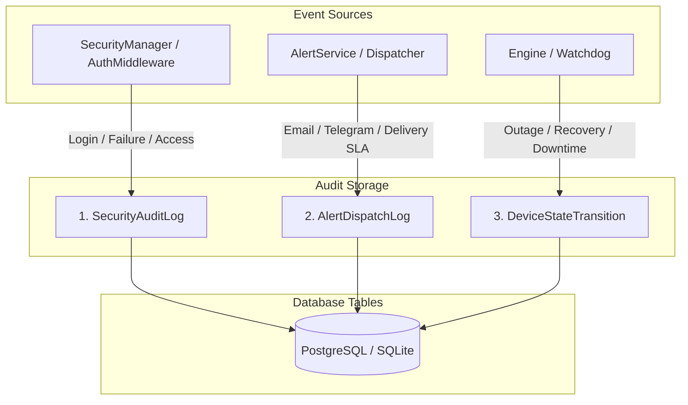

# 🔍 Audit Trail & Observability Subsystem

This document specifies the compliance and audit subsystem of **Noxfort Monitor™ v2.0**, detailing security access auditing, alert dispatch SLA tracking, and device downtime monitoring.

⬅️ [Central Hub](../README.md) | 🏛️ [Architecture](architecture.md) | 🔐 [Security](security.md)

---

## 1. Triple Audit Architecture

Noxfort Monitor segregates audit trails into three immutable persistence streams:

---

## 2. Models & Field Specifications

### 2.1 `SecurityAuditLog`
Records authentication attempts, credential changes, and administrative actions:
* `id` (*int64*): Sequential identifier.
* `action` (*string*): `LOGIN_SUCCESS`, `LOGIN_FAILED`, `CONFIG_UPDATE`, `USER_CREATE`.
* `username` (*string*): Actor username.
* `ip_address` (*string*): Remote client IP address.
* `user_agent` (*string*): Browser / API user agent.
* `created_at` (*timestamp*): Record creation time.

### 2.2 `AlertDispatchLog`
Guarantees forensic compliance for incident alert delivery SLAs:
* `incident_id` (*int64*): Originating telemetry incident reference.
* `contact_id` (*int64*): Recipient contact identifier.
* `channel` (*string*): `EMAIL` or `TELEGRAM`.
* `status` (*string*): `SENT` or `FAILED`.
* `error_message` (*string*): Diagnostic message on network failure.
* `dispatched_at` (*timestamp*): Precise delivery timestamp.

### 2.3 `DeviceStateTransition`
Tracks equipment uptime and calculates total downtime:
* `device_id` (*int64*): Monitored device reference.
* `from_state` (*string*): `ONLINE` / `OFFLINE`.
* `to_state` (*string*): `OFFLINE` / `ONLINE`.
* `transitioned_at` (*timestamp*): When the state change was detected.
* `downtime_seconds` (*int64*): Evaluated total downtime upon recovery.
