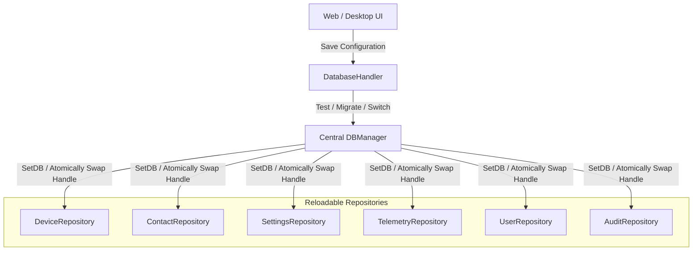

# 🗄️ Persistence & Dual-Engine Architecture

This document details the dual-engine persistence layer of **Noxfort Monitor™ v2.0**, covering PostgreSQL and SQLite coexistence, the live connection hot-reload manager (`DBManager`), automated data migration, and the SQL dialect adapter.

⬅️ [Central Hub](../README.md) | 🏛️ [Architecture](architecture.md) | 📡 [API](api_reference.md) | 🔐 [Security](security.md)

---

## 1. Dual-Engine Coexistence

Noxfort Monitor supports both lightweight standalone deployments and distributed high-availability clusters through an engine-agnostic persistence layer:

| Dimension | SQLite (Pure-Go) | PostgreSQL |
|---|---|---|
| **Go Driver** | `modernc.org/sqlite` (CGO-free) | `github.com/lib/pq` |
| **Use Case** | Single-user workstations, local edge nodes | High-concurrency servers, enterprise networks |
| **File / Host** | `~/Documentos/Monitor/monitor_logs.db` | TCP Server (port `5432`) |
| **Schema Isolation** | Single file database | Dedicated schema (`schema_monitor`) |
| **Dependencies** | None (embedded in Go binary) | External PostgreSQL 12+ server |

---

## 2. Dynamic Hot-Reload (`DBManager`)

The `DBManager` orchestrates runtime database switching without restarting the process or dropping active client connections:



Every repository implements `ReloadableRepository`:
```go
type ReloadableRepository interface {
    SetDB(db *sql.DB)
}
```

---

## 3. Automated Heterogeneous Migration (`MigrateData`)

When switching between SQLite and PostgreSQL, `MigrateData()` guarantees zero data loss:
1. Opens source and destination database handles concurrently.
2. Extracts devices, contacts, users, settings, and telemetry history.
3. Performs upsert operations using `storage.AdaptQuery()` to resolve dialect differences (`ON CONFLICT (id) DO UPDATE`).
4. Re-points all repositories to the destination database and persists the new configuration to disk.
