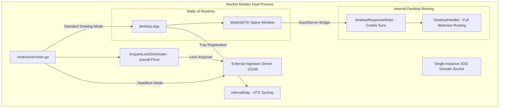

# 🖥️ Desktop Application & Operations (Wails v2 & Headless)

This document details the native desktop architecture of **Noxfort Monitor™ v2.0**, built with **Wails v2** and **WebKitGTK**, atomic kernel-level file locking via `syscall.Flock`, system tray integration, and headless server operation.

⬅️ [Central Hub](../README.md) | 🏛️ [Architecture](architecture.md) | 🚀 [Deployment](deployment.md)

---

## 1. Wails v2 Architecture

Instead of high-overhead Chromium/Electron runtimes, Noxfort Monitor utilizes **Wails v2** paired with native Linux **WebKitGTK**:



### Key Parameters:
* **Default Window**: 1280x800 px (minimum 1024x600 px).
* **GPU Acceleration**: `linux.WebviewGpuPolicyOnDemand`.
* **Minimize on Close**: `HideWindowOnClose: true`. Closing the window hides it to the system tray while server goroutines continue running uninterrupted.

---

## 2. Single-Instance Enforcement (Atomic Kernel Lock & IPC)

To prevent port conflicts (MQTT `:1883`, HTTP `:22100`) and database corruption:
1. **Kernel File Lock (`syscall.Flock`) via `AcquireLockOrActivate()`**:
   - Acquires an exclusive non-blocking lock on `$XDG_RUNTIME_DIR/noxfort-monitor.lock` (or `/tmp/noxfort-monitor-<uid>.lock`).
   - If another instance holds the lock, calls `desktop.TryActivateExisting()` and terminates immediately (`code 0`).
2. **Unix Domain IPC Socket**:
   - The primary instance listens on `$XDG_RUNTIME_DIR/noxfort-monitor.sock`.
   - Subsequent process invocations send an `ACTIVATE` command, bringing the running window to the foreground via `desktopApp.RestoreWindow()`.

---

## 3. Server Mode (`--headless`)

For servers without a graphical environment (X11 / Wayland):
```bash
./bin/noxfort-monitor --headless
# Or via Makefile:
make run-headless
```

### Headless Mode Behaviors:
1. **Bypasses GUI**: Skips Wails v2 and WebKitGTK initialization completely.
2. **Restricted Ingestion Listener**: Starts `ExternalIngestionHandler` on port `22100`, serving exclusively `POST /api/telemetry`.
3. **Browser Access Blocked (403)**: Web browser access to control routes is blocked with HTTP 403 Forbidden. The node operates purely as an autonomous telemetry ingestion and alert dispatching engine.
4. **Graceful Shutdown**: Blocks on OS termination signals (`SIGINT`, `SIGTERM`), cleanly releasing kernel locks upon exit.
