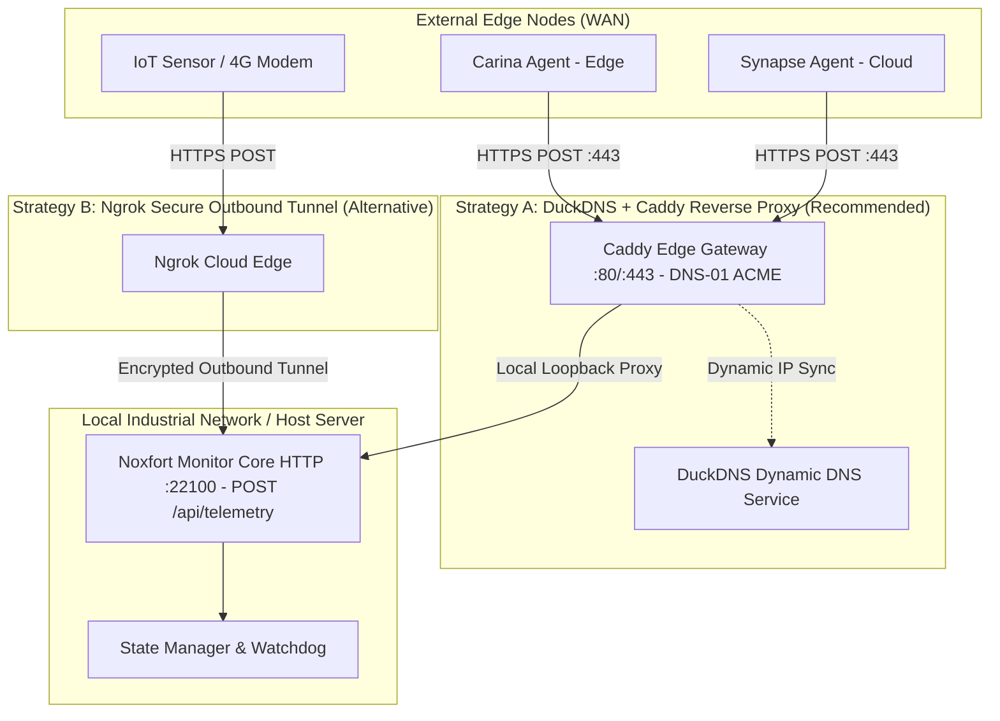

# 🌐 Remote Access & WAN Telemetry Ingestion (DuckDNS & Ngrok)

This document details the wide-area network (WAN) architecture of **Noxfort Monitor™ v2.0**, covering dynamic DNS updates via **DuckDNS**, automated HTTPS termination with **Caddy Server**, and fallback reverse tunneling powered by **Ngrok** for external telemetry ingestion (**Carina**, **Synapse**, IoT sensors).

⬅️ [Central Hub](../README.md) | 🏛️ [Architecture](architecture.md) | 📡 [API](api_reference.md) | 🚀 [Deployment](deployment.md)

---

## 1. WAN Connectivity Strategies

Noxfort Monitor provides dual complementary strategies for traversing firewalls and NAT:



1. **DuckDNS + Caddy (Primary / Recommended)**:
   - Synchronizes your custom subdomain (`your-subdomain.duckdns.org`) with your host machine's public IPv4/IPv6.
   - [Caddy Server](../CADDY_INTEGRATION.md) obtains valid TLS certificates via **DNS-01 ACME challenge** without requiring inbound port 80 to be open.
   - Standardizes external traffic on ports 80 and 443 with encrypted WebSockets (`/mqtt`).
2. **Ngrok Reverse Tunnel (Zero-Forwarding Fallback)**:
   - Establishes an encrypted outbound TLS tunnel for networks behind strict carrier CGNAT where port forwarding is impossible.

---

## 2. Driver Architecture (`internal/tunnel`)

The tunnel subsystem implements the Dependency Inversion Principle (DIP):
```go
type Service interface {
    Start(authToken, domain string) error
    Stop() error
    GetStatus() Status
    IsBinaryAvailable() bool
    TestConnection(ctx context.Context, token, domain string) (*TestResult, error)
}
```

* **`DuckDNSDriver`**: Dispatches dynamic DNS updates via HTTP API, detects system IPv6 addresses, and executes on-demand resolution diagnostics (`POST /api/tunnel/test`).
* **`NgrokDriver`**: Manages the child `ngrok` client process and monitors tunnel health.
* **Database Persistence**: WAN configuration is stored in the `settings` table (`duckdns_token`, `duckdns_domain`, `duckdns_enabled` and Ngrok fields).
* **API Endpoints**:
  * `GET /api/tunnel/status`: Returns state, provider, public URLs, and IPv6.
  * `POST /api/tunnel/save`: Saves DuckDNS or Ngrok parameters.
  * `POST /api/tunnel/start`: Initiates dynamic DNS update or launches tunnel.
  * `POST /api/tunnel/stop`: Halts WAN updates and disables auto-start.
  * `POST /api/tunnel/disconnect`: Unlinks credentials from the database and terminates service.
  * `POST /api/tunnel/test`: Validates DuckDNS token and domain resolution in real time.
