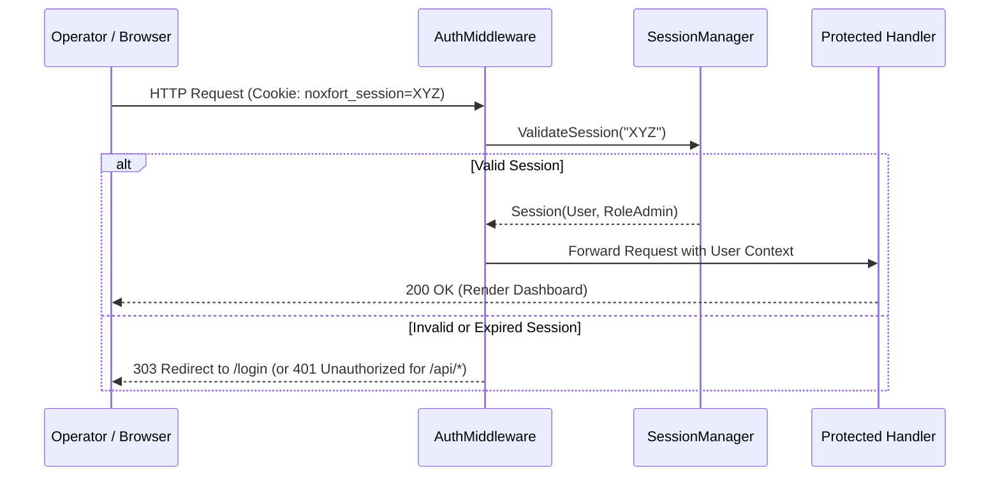

# 🔐 Security, Authentication & Role-Based Access Control (RBAC)

This document details the security architecture of **Noxfort Monitor™ v2.0**, including authentication, session token lifecycle, salted password hashing, and Role-Based Access Control (RBAC).

⬅️ [Central Hub](../README.md) | 🏛️ [Architecture](architecture.md) | 🔍 [Audit Trail](audit_trail.md) | 📡 [API](api_reference.md)

---

## 1. Security Architecture & RBAC

Noxfort Monitor enforces strict role segregation:

* **`RoleAdmin` ("ADMIN")**: Full administrative privileges: user management, database migration, reverse tunnel activation, and global system configuration.
* **`RoleOperator` ("OPERATOR")**: Operational privileges: viewing dashboard telemetry, monitoring registered devices, and inspecting alerts.
* **Incident Routing Roles**:
  * **`TECHNICIAN`**: Receives only `HARDWARE` incident notifications.
  * **`PROGRAMMER`**: Receives only `SOFTWARE` incident notifications.
  * **`ADMIN`**: Receives all global incidents.

---

## 2. Password Hashing & Salt Isolation

Passwords are encrypted using cryptographic salt and SHA-256 derivation via `internal/security/hasher.go`:
* Unique 16-byte random salt generated per user.
* Passwords and hashes are strictly excluded from JSON serialization (`json:"-"`).
* Constant-time comparison defends against timing attacks.

---

## 3. Session Lifecycle & AuthMiddleware

* **Session Storage**: In-memory thread-safe map with mutex synchronization.
* **Sliding Renewal**: Active user requests renew the 24-hour expiration window.
* **Dual Interception**: Web UI requests without a session redirect to `/login` with HTTP `303 See Other`; API calls return JSON `401 Unauthorized`.
