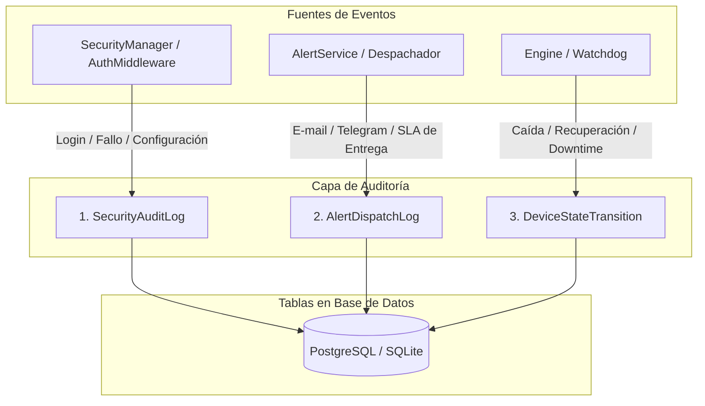

# 🔍 Pista de Auditoría y Observabilidad

Este documento especifica el subsistema de auditoría y cumplimiento de **Noxfort Monitor™ v2.0**, abarcando la trazabilidad de accesos de seguridad, verificación de SLA de alertas y monitorización de caídas de dispositivos.

⬅️ [Hub Central](../README.md) | 🏛️ [Arquitectura](architecture.md) | 🔐 [Seguridad](security.md)

---

## 1. Arquitectura de Triple Auditoría

Noxfort Monitor separa los registros de auditoría en tres corrientes independientes e inmutables:

---

## 2. Modelos y Definición de Campos

### 2.1 `SecurityAuditLog`
Registra intentos de autenticación, cambios de credenciales y acciones administrativas:
* `id` (*int64*): Identificador secuencial único.
* `action` (*string*): `LOGIN_SUCCESS`, `LOGIN_FAILED`, `CONFIG_UPDATE`, `USER_CREATE`.
* `username` (*string*): Usuario que ejecuta la acción.
* `ip_address` (*string*): Dirección IP del cliente remoto.
* `user_agent` (*string*): Identificación del navegador o script cliente.
* `created_at` (*timestamp*): Fecha y hora en formato UTC.

### 2.2 `AlertDispatchLog`
Garantiza el cumplimiento pericial del acuerdo de nivel de servicio (SLA) de alertas:
* `incident_id` (*int64*): Referencia al incidente de origen.
* `contact_id` (*int64*): Identificador del contacto destinatario.
* `channel` (*string*): `EMAIL` o `TELEGRAM`.
* `status` (*string*): `SENT` o `FAILED`.
* `error_message` (*string*): Mensaje de error en caso de fallo de red.
* `dispatched_at` (*timestamp*): Momento exacto del intento de transmisión.

### 2.3 `DeviceStateTransition`
Registra la disponibilidad de los equipos y evalúa el tiempo total de inactividad:
* `device_id` (*int64*): Identificador del nodo monitorizado.
* `from_state` (*string*): `ONLINE` / `OFFLINE`.
* `to_state` (*string*): `OFFLINE` / `ONLINE`.
* `transitioned_at` (*timestamp*): Momento en que se detectó la transición.
* `downtime_seconds` (*int64*): Segundos totales transcurridos hasta la recuperación.
