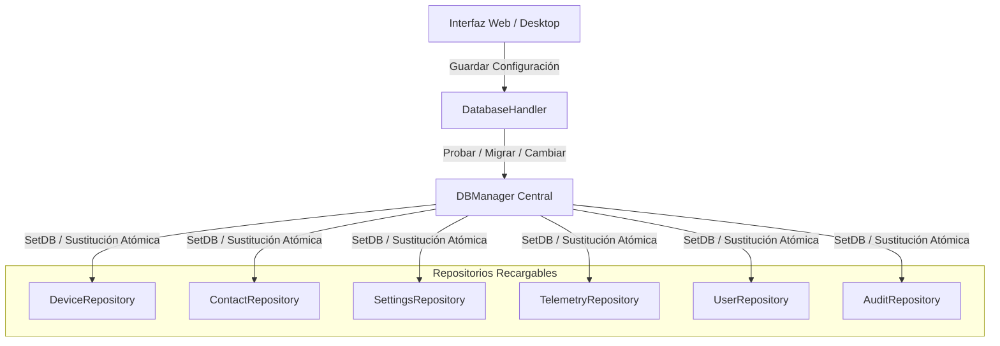

# 🗄️ Persistencia y Arquitectura Dual-Engine

Este documento detalla la capa de persistencia dual-engine de **Noxfort Monitor™ v2.0**, abarcando la coexistencia de PostgreSQL y SQLite, el gestor de recarga en caliente (`DBManager`), la migración automática y el adaptador de dialectos SQL.

⬅️ [Hub Central](../README.md) | 🏛️ [Arquitectura](architecture.md) | 📡 [API](api_reference.md) | 🔐 [Seguridad](security.md)

---

## 1. Coexistencia Dual-Engine

Noxfort Monitor soporta despliegues autónomos ligeros y clústeres distribuidos empresariales de alta disponibilidad:

| Dimensión | SQLite (Puro en Go) | PostgreSQL |
|---|---|---|
| **Driver Go** | `modernc.org/sqlite` (sin CGO) | `github.com/lib/pq` |
| **Caso de Uso** | Estaciones de trabajo locales, nodos de borde | Servidores industriales, alta concurrencia |
| **Ubicación** | `~/Documentos/Monitor/monitor_logs.db` | Servidor TCP (puerto `5432`) |
| **Aislamiento** | Base de datos de archivo único | Esquema dedicado (`schema_monitor`) |
| **Dependencias** | Ninguna (embebido en el binario Go) | Servidor PostgreSQL 12+ en red |

---

## 2. Recarga Dinámica en Caliente (`DBManager`)

El componente `DBManager` gestiona el cambio de base de datos en tiempo de ejecución sin reiniciar el proceso ni desconectar clientes activos:



Cada repositorio implementa la interfaz `ReloadableRepository`:
```go
type ReloadableRepository interface {
    SetDB(db *sql.DB)
}
```

---

## 3. Migración Heterogénea Automática (`MigrateData`)

Al alternar entre SQLite y PostgreSQL, `MigrateData()` garantiza la integridad de los datos:
1. Abre conexiones concurrentes a las bases de datos de origen y destino.
2. Extrae dispositivos, contactos, usuarios, configuraciones e historial de incidentes.
3. Inserta registros usando `storage.AdaptQuery()` para adaptar la sintaxis (`ON CONFLICT (id) DO UPDATE`).
4. Reenlaza los repositorios a la base destino y guarda la configuración en disco.
