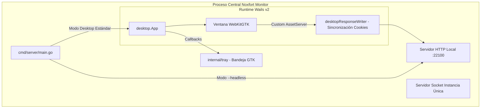

# 🖥️ Aplicación Desktop y Operaciones (Wails v2 & Headless)

Este documento detalla la arquitectura de escritorio de **Noxfort Monitor™ v2.0**, desarrollada con **Wails v2** y **WebKitGTK**, bloqueo de instancia única mediante socket Unix, bandeja del sistema y modo servidor daemon (`--headless`).

⬅️ [Hub Central](../README.md) | 🏛️ [Arquitectura](architecture.md) | 🚀 [Despliegue](deployment.md)

---

## 1. Arquitectura Wails v2

En lugar de marcos pesados basados en Chromium/Electron, Noxfort Monitor implementa **Wails v2** junto con **WebKitGTK** nativo de Linux:



### Especificaciones:
* **Resolución Estándar**: 1280x800 px (mínimo 1024x600 px).
* **Aceleración por GPU**: `linux.WebviewGpuPolicyOnDemand`.
* **Minimizar al Cerrar**: `HideWindowOnClose: true`. Al presionar cerrar ("X"), la ventana se oculta en la bandeja sin interrumpir los servicios.

---

## 2. Bloqueo de Instancia Única (Socket Unix IPC)

Para impedir conflictos de red (MQTT `:1883`, HTTP `:22100`):
1. `desktop.TryActivateExisting()` comprueba `/tmp/noxfort-monitor-singleinstance.sock`.
2. Si detecta una instancia en ejecución, envía `ACTIVATE` y finaliza de inmediato con código `0`.
3. La instancia activa recibe la orden, restaura la ventana y la sitúa al frente.

---

## 3. Modo Servidor Headless (`--headless`)

Para servidores sin interfaz gráfica (X11 / Wayland):
```bash
./bin/noxfort-monitor --headless
# O mediante Makefile:
make run-headless
```
En este modo se omite la carga gráfica y la ejecución queda en espera de señales de terminación del sistema operativo (`SIGINT`, `SIGTERM`).
