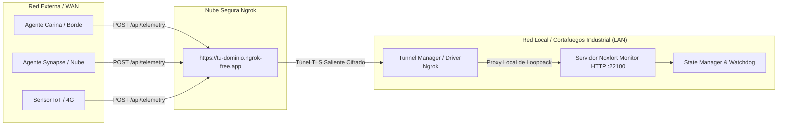

# 🌐 Acceso Remoto e Ingestión WAN (Túnel Ngrok)

Este documento detalla la arquitectura de comunicación en red de área amplia (WAN) de **Noxfort Monitor™ v2.0**, cubriendo el túnel inverso mediante **Ngrok**, el traspaso de cortafuegos y CGNAT, y la ingestión de agentes externos (**Carina**, **Synapse**).

⬅️ [Hub Central](../README.md) | 🏛️ [Arquitectura](architecture.md) | 📡 [API](api_reference.md) | 🚀 [Despliegue](deployment.md)

---

## 1. El Rol del Túnel Inverso Industrial

En despliegues de monitorización industrial, el servidor central a menudo reside dentro de una red local privada (LAN), detrás de enrutadores NAT, conexiones móviles con CGNAT o cortafuegos empresariales que prohíben la apertura de puertos entrantes.



Al establecer un enlace cifrado TLS de **salida** hacia Ngrok, Noxfort Monitor recibe telemetría de la internet pública sin necesidad de contar con una dirección IP pública estática.

---

## 2. Abstracción del Driver (`internal/tunnel`)

El subsistema aplica el Principio de Inversión de Dependencias (DIP):
```go
type Service interface {
    Start(authToken, domain string) error
    Stop() error
    GetStatus() Status
    IsBinaryAvailable() bool
}
```

* **`NgrokDriver`**: Controla el cliente binario de Ngrok, captura la URL pública asignada y verifica la salud de la conexión.
* **Dominios Estáticos**: Soporta dominios fijos reservados para mantener intacta la configuración de los sensores tras reinicios.
