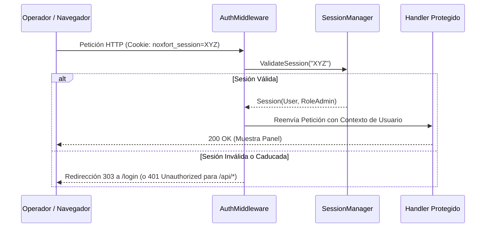

# 🔐 Seguridad, Autenticación y Control de Acceso (RBAC)

Este documento detalla la arquitectura de seguridad de **Noxfort Monitor™ v2.0**, abarcando autenticación, ciclo de vida de sesiones, hash de contraseñas con sal y Control de Acceso Basado en Roles (RBAC).

⬅️ [Hub Central](../README.md) | 🏛️ [Arquitectura](architecture.md) | 🔍 [Pista de Auditoría](audit_trail.md) | 📡 [API](api_reference.md)

---

## 1. Segregación de Roles y Permisos

Noxfort Monitor aplica una separación estricta de responsabilidades:

* **`RoleAdmin` ("ADMIN")**: Privilegios administrativos completos: gestión de usuarios, migración de bases de datos, activación de túneles y configuración del sistema.
* **`RoleOperator` ("OPERATOR")**: Privilegios de operación: consulta del cuadro de mando, estado de equipos y registros de incidentes.
* **Roles de Enrutamiento de Alertas**:
  * **`TECHNICIAN`**: Recibe exclusivamente alertas de categoría `HARDWARE`.
  * **`PROGRAMMER`**: Recibe exclusivamente alertas de categoría `SOFTWARE`.
  * **`ADMIN`**: Recibe todas las alertas globales.

---

## 2. Hash con Sal Criptográfica

Las contraseñas se protegen mediante derivación SHA-256 con sal aleatoria en `internal/security/hasher.go`:
* Sal criptográfica única de 16 bytes generada por usuario.
* Contraseñas y hashes quedan estrictamente excluidos de la serialización JSON (`json:"-"`).
* Comparación en tiempo constante para evitar ataques de temporización.

---

## 3. Ciclo de Vida de Sesiones y AuthMiddleware

* **Almacenamiento**: Mapa en memoria protegido por mutex.
* **Renovación Deslizante**: Cada petición activa extiende la expiración en 24 horas.
* **Intercepción Inteligente**: Las peticiones web no autenticadas se redirigen con HTTP `303 See Other`; las llamadas a la API devuelven JSON `401 Unauthorized`.
