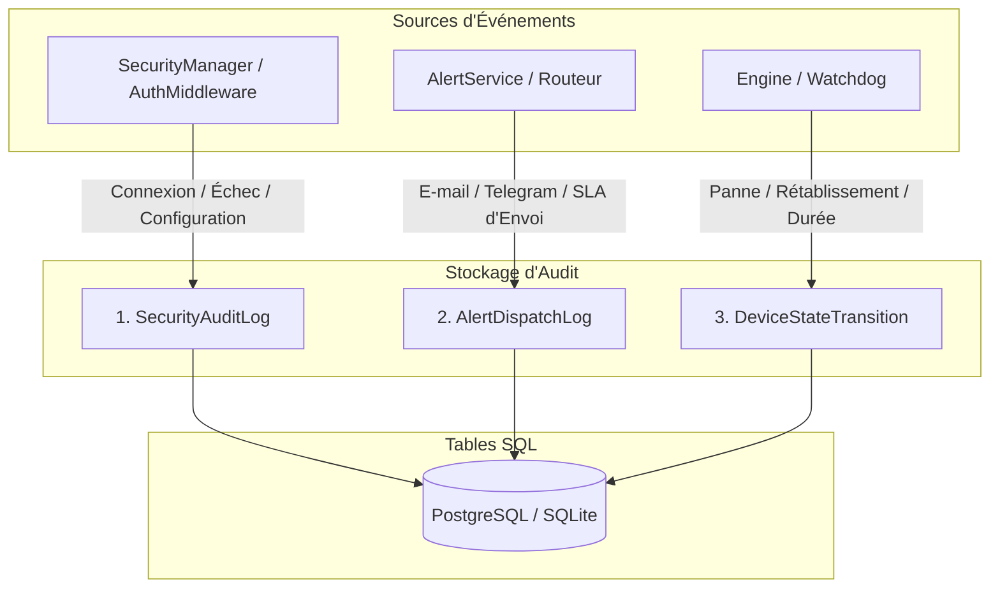

# 🔍 Piste d'Audit et Observabilité

Ce document spécifie le sous-système d'audit et de conformité de **Noxfort Monitor™ v2.0**, couvrant la traçabilité des accès de sécurité, le respect des SLA d'alerte et la surveillance des temps d'arrêt.

⬅️ [Hub Central](../README.md) | 🏛️ [Architecture](architecture.md) | 🔐 [Sécurité](security.md)

---

## 1. Architecture de l'Audit Triple

Noxfort Monitor sépare les enregistrements d'audit en trois flux persistants immuables :

---

## 2. Modèles de Données et Définition des Champs

### 2.1 `SecurityAuditLog`
Consigne les tentatives de connexion, modifications de droits et actions d'administration :
* `id` (*int64*) : Identifiant séquentiel unique.
* `action` (*string*) : `LOGIN_SUCCESS`, `LOGIN_FAILED`, `CONFIG_UPDATE`, `USER_CREATE`.
* `username` (*string*) : Nom de l'utilisateur concerné.
* `ip_address` (*string*) : Adresse IP du client distant.
* `user_agent` (*string*) : Signature du navigateur ou client HTTP.
* `created_at` (*timestamp*) : Horodatage UTC de l'événement.

### 2.2 `AlertDispatchLog`
Assure la traçabilité légale pour la vérification des accords de niveau de service (SLA) :
* `incident_id` (*int64*) : Référence à l'incident télémétrique source.
* `contact_id` (*int64*) : Identifiant du contact destinataire.
* `channel` (*string*) : `EMAIL` ou `TELEGRAM`.
* `status` (*string*) : `SENT` ou `FAILED`.
* `error_message` (*string*) : Description de l'erreur en cas d'échec réseau.
* `dispatched_at` (*timestamp*) : Moment exact de la tentative d'émission.

### 2.3 `DeviceStateTransition`
Enregistre la disponibilité des équipements et calcule le temps d'arrêt cumulé :
* `device_id` (*int64*) : Identifiant du nœud surveillé.
* `from_state` (*string*) : `ONLINE` / `OFFLINE`.
* `to_state` (*string*) : `OFFLINE` / `ONLINE`.
* `transitioned_at` (*timestamp*) : Moment de détection du changement d'état.
* `downtime_seconds` (*int64*) : Secondes totales d'indisponibilité lors de la récupération.
