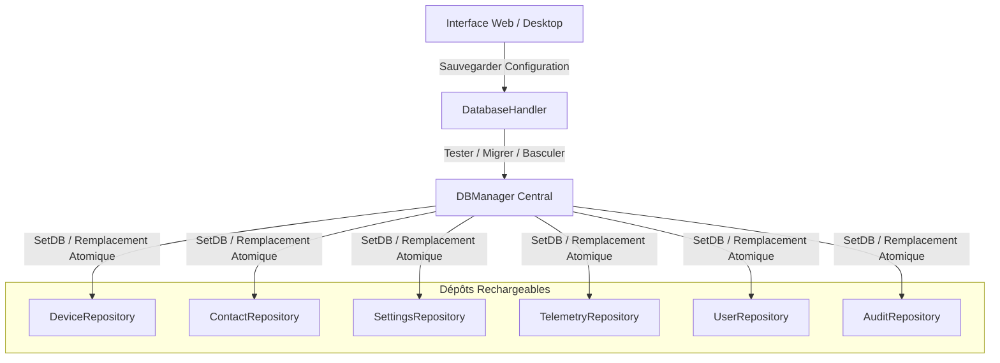

# 🗄️ Persistance et Architecture Double-Moteur

Ce document détaille la couche de persistance double-moteur de **Noxfort Monitor™ v2.0**, couvrant la prise en charge de PostgreSQL et SQLite, le rechargement à chaud en direct (`DBManager`), la migration automatique des données et l'adaptation des requêtes SQL.

⬅️ [Hub Central](../README.md) | 🏛️ [Architecture](architecture.md) | 📡 [API](api_reference.md) | 🔐 [Sécurité](security.md)

---

## 1. Coexistence Double-Moteur

Noxfort Monitor prend en charge à la fois les déploiements autonomes légers et les grappes de serveurs hautement disponibles :

| Dimension | SQLite (Pur en Go) | PostgreSQL |
|---|---|---|
| **Pilote Go** | `modernc.org/sqlite` (sans CGO) | `github.com/lib/pq` |
| **Cas d'Usage** | Postes de travail locaux, passerelles de bordure | Serveurs industriels, haute concurrence |
| **Emplacement** | `~/Documentos/Monitor/monitor_logs.db` | Serveur TCP (port `5432`) |
| **Isolation** | Base de données locale monofichier | Schéma dédié (`schema_monitor`) |
| **Dépendances** | Aucune (intégré au binaire Go) | Serveur PostgreSQL 12+ en réseau |

---

## 2. Rechargement Dynamique à Chaud (`DBManager`)

Le composant `DBManager` pilote l'alternance de base de données à l'exécution sans redémarrage du processus ni rupture de session :



Tous les dépôts implémentent l'interface `ReloadableRepository` :
```go
type ReloadableRepository interface {
    SetDB(db *sql.DB)
}
```

---

## 3. Migration Hétérogène Automatique (`MigrateData`)

Lors du basculement entre SQLite et PostgreSQL, la procédure `MigrateData()` garantit l'intégrité intégrale :
1. Ouvre des connexions simultanées vers la base source et la base cible.
2. Extrait les équipements, contacts, utilisateurs, paramètres et journaux télémétriques.
3. Exécute les opérations d'insertion/mise à jour via `storage.AdaptQuery()` pour adapter les particularités syntaxiques (`ON CONFLICT (id) DO UPDATE`).
4. Reconnecte l'ensemble des dépôts à la base cible et sauvegarde la configuration sur disque.
