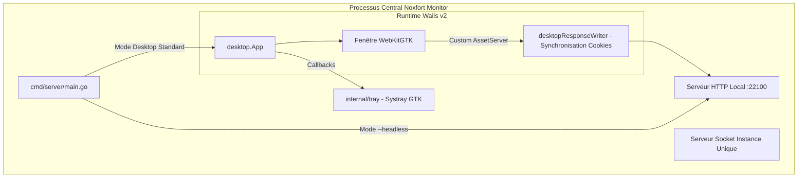

# 🖥️ Application Desktop et Exploitation (Wails v2 & Headless)

Ce document détaille l'architecture desktop de **Noxfort Monitor™ v2.0**, conçue avec **Wails v2** et **WebKitGTK**, le verrouillage d'instance unique par socket Unix, la gestion de la barre des tâches et le mode daemon serveur (`--headless`).

⬅️ [Hub Central](../README.md) | 🏛️ [Architecture](architecture.md) | 🚀 [Déploiement](deployment.md)

---

## 1. Architecture Wails v2

Pour éviter la surcharge des moteurs Chromium/Electron, Noxfort Monitor utilise **Wails v2** couplé au composant natif Linux **WebKitGTK** :



### Paramètres Techniques :
* **Résolution Standard** : 1280x800 px (minimum 1024x600 px).
* **Accélération Graphique** : `linux.WebviewGpuPolicyOnDemand`.
* **Minimisation à la Fermeture** : `HideWindowOnClose: true`. Le clic sur la croix ("X") masque l'interface sans stopper les serveurs en arrière-plan.

---

## 2. Verrouillage d'Instance Unique (Socket IPC Unix)

Pour éviter les collisions de ports réseau (MQTT `:1883`, HTTP `:22100`) :
1. `desktop.TryActivateExisting()` sonde `/tmp/noxfort-monitor-singleinstance.sock`.
2. Si une instance existe déjà, elle transmet la commande `ACTIVATE` et quitte immédiatement avec le code `0`.
3. L'instance active reçoit le signal, restaure la fenêtre depuis la barre d'état et la place au premier plan.

---

## 3. Mode Serveur Headless (`--headless`)

Pour les serveurs en nuage ou postes sans serveur d'affichage (X11 / Wayland) :
```bash
./bin/noxfort-monitor --headless
# Ou via le Makefile :
make run-headless
```
Dans ce mode, l'initialisation de l'interface graphique est contournée et le processus principal bloque sur les signaux système (`SIGINT`, `SIGTERM`).
