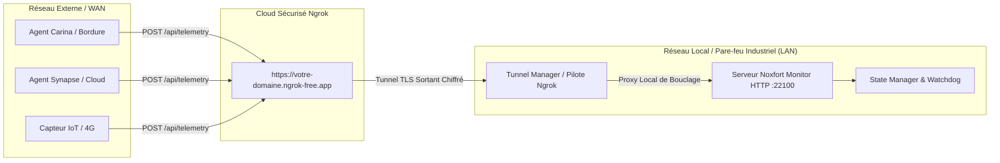

# 🌐 Accès Distant et Ingestion WAN (Tunnel Ngrok)

Ce document détaille l'architecture réseau longue distance (WAN) de **Noxfort Monitor™ v2.0**, couvrant le sous-système de tunnel inverse sécurisé par **Ngrok**, le franchissement des pare-feu industriels et du CGNAT, et l'ingestion d'agents distants (**Carina**, **Synapse**).

⬅️ [Hub Central](../README.md) | 🏛️ [Architecture](architecture.md) | 📡 [API](api_reference.md) | 🚀 [Déploiement](deployment.md)

---

## 1. Nécessité du Tunnel Inverse en Milieu Industriel

Dans les installations industrielles, le serveur de supervision réside souvent au sein d'un réseau local privé (LAN), derrière un routeur avec NAT, un réseau cellulaire sous CGNAT ou des pare-feu d'entreprise stricts interdisant toute redirection de ports entrants.



En établissant une connexion chiffrée TLS **sortante** vers Ngrok, Noxfort Monitor reçoit la télémétrie de l'internet public sans nécessiter d'adresse IP publique statique.

---

## 2. Abstraction du Pilote (`internal/tunnel`)

Le sous-système de tunnelage applique le principe d'inversion des dépendances (DIP) :
```go
type Service interface {
    Start(authToken, domain string) error
    Stop() error
    GetStatus() Status
    IsBinaryAvailable() bool
}
```

* **`NgrokDriver`** : Supervise le processus client natif Ngrok, extrait l'URL publique des journaux et vérifie la disponibilité du lien.
* **Domaines Statiques** : Prise en charge des domaines fixes personnalisés pour préserver la configuration des capteurs distants après redémarrage.
