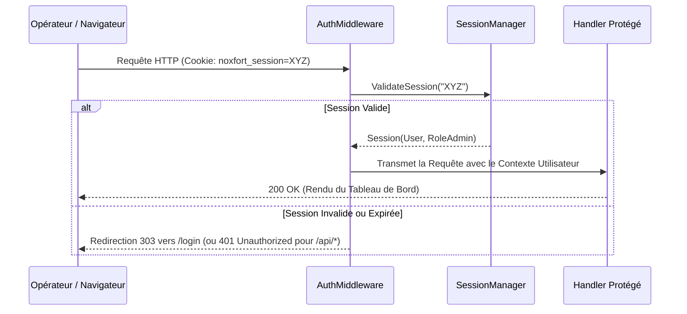

# 🔐 Sécurité, Authentification et Contrôle d'Accès (RBAC)

Ce document spécifie l'architecture de sécurité de **Noxfort Monitor™ v2.0**, couvrant l'authentification, le cycle de vie des sessions, le hachage des mots de passe et le Contrôle d'Accès Basé sur les Rôles (RBAC).

⬅️ [Hub Central](../README.md) | 🏛️ [Architecture](architecture.md) | 🔍 [Piste d'Audit](audit_trail.md) | 📡 [API](api_reference.md)

---

## 1. Ségrégation des Privilèges et Rôles

Noxfort Monitor applique une politique stricte d'habilitation :

* **`RoleAdmin` ("ADMIN")** : Privilèges complets d'administration : gestion des utilisateurs, migration de bases de données, gestion du tunnel distant et configuration système.
* **`RoleOperator` ("OPERATOR")** : Privilèges opérationnels : consultation de la télémétrie, des équipements enregistrés et de l'historique d'alertes.
* **Rôles de Routage d'Incidents** :
  * **`TECHNICIAN`** : Reçoit exclusivement les alertes de catégorie `HARDWARE`.
  * **`PROGRAMMER`** : Reçoit exclusivement les alertes de catégorie `SOFTWARE`.
  * **`ADMIN`** : Reçoit l'ensemble des alertes.

---

## 2. Hachage avec Sel Cryptographique

Les mots de passe sont protégés par dérivation SHA-256 avec sel cryptographique via `internal/security/hasher.go` :
* Sel aléatoire unique de 16 octets généré pour chaque compte.
* Mots de passe et empreintes sont strictement exclus de la sérialisation JSON (`json:"-"`).
* Comparaison en temps constant pour prévenir les attaques temporelles.

---

## 3. Cycle de Vie des Sessions et AuthMiddleware

* **Stockage en Mémoire** : Table de hachage synchronisée par mutex.
* **Renouvellement Glissant** : Toute activité prolonge la validité de 24 heures.
* **Interception Adaptée** : Les requêtes web sans session sont redirigées vers `/login` avec HTTP `303 See Other` ; les requêtes API retournent `401 Unauthorized`.
