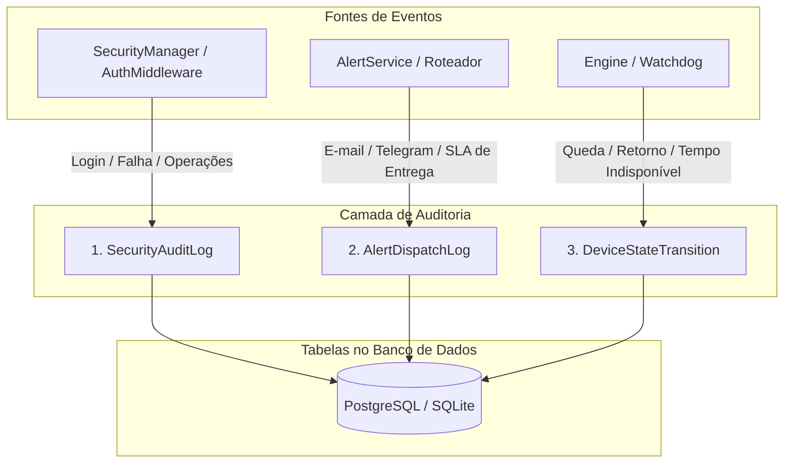

# 🔍 Trilha de Auditoria e Observabilidade

Este documento especifica o subsistema de auditoria e conformidade do **Noxfort Monitor™ v2.0**, cobrindo o rastreamento de acessos de segurança, verificação de SLA de alertas e monitoramento de indisponibilidade de nós.

⬅️ [Central de Documentação](../README.md) | 🏛️ [Arquitetura](architecture.md) | 🔐 [Segurança](security.md)

---

## 1. Arquitetura da Auditoria Tripla

O Noxfort Monitor segrega os registros de auditoria em três fluxos imutáveis e independentes:

---

## 2. Modelos e Especificações de Campos

### 2.1 `SecurityAuditLog`
Registra tentativas de autenticação, alterações de credenciais e ações administrativas:
* `id` (*int64*): Identificador sequencial unívoco.
* `action` (*string*): `LOGIN_SUCCESS`, `LOGIN_FAILED`, `CONFIG_UPDATE`, `USER_CREATE`.
* `username` (*string*): Usuário executor da ação.
* `ip_address` (*string*): Endereço IP do cliente remoto.
* `user_agent` (*string*): Identificação do navegador ou script cliente.
* `created_at` (*timestamp*): Data e hora do registro em UTC.

### 2.2 `AlertDispatchLog`
Assegura conformidade pericial para comprovação de SLA de entrega de alertas:
* `incident_id` (*int64*): Referência ao incidente de telemetria originário.
* `contact_id` (*int64*): Identificador do contato destinatário.
* `channel` (*string*): `EMAIL` ou `TELEGRAM`.
* `status` (*string*): `SENT` ou `FAILED`.
* `error_message` (*string*): Descrição do erro em caso de falha de conexão.
* `dispatched_at` (*timestamp*): Momento preciso da tentativa de transmissão.

### 2.3 `DeviceStateTransition`
Rastreia a disponibilidade do equipamento e calcula o tempo total de queda:
* `device_id` (*int64*): Identificador do nó monitorado.
* `from_state` (*string*): `ONLINE` / `OFFLINE`.
* `to_state` (*string*): `OFFLINE` / `ONLINE`.
* `transitioned_at` (*timestamp*): Momento em que a alteração de estado foi detectada.
* `downtime_seconds` (*int64*): Segundos totais de indisponibilidade apurados na recuperação.
