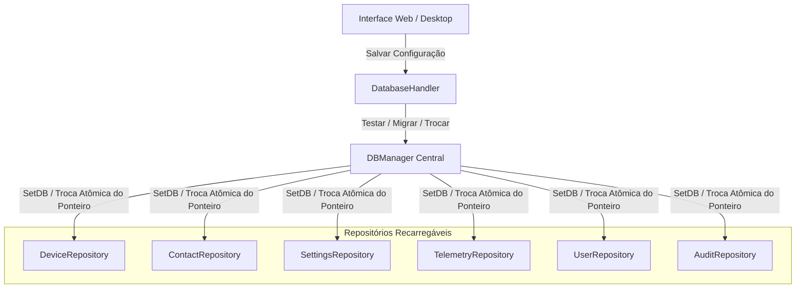

# 🗄️ Persistência e Arquitetura Dual-Engine

Este documento detalha a camada de persistência dual-engine do **Noxfort Monitor™ v2.0**, cobrindo o suporte nativo a PostgreSQL e SQLite, o gerenciador de troca dinâmica a quente (`DBManager`), o migrador automático de dados e o adaptador de dialetos SQL.

⬅️ [Central de Documentação](../README.md) | 🏛️ [Arquitetura](architecture.md) | 📡 [API](api_reference.md) | 🔐 [Segurança](security.md)

---

## 1. Coexistência Dual-Engine

O Noxfort Monitor suporta tanto implantações locais e isoladas quanto clusters distribuídos empresariais:

| Dimensão | SQLite (Puro em Go) | PostgreSQL |
|---|---|---|
| **Driver Go** | `modernc.org/sqlite` (sem CGO) | `github.com/lib/pq` |
| **Caso de Uso** | Estações locais de operação, nós de borda | Servidores industriais, alta concorrência |
| **Arquivo / Host** | `~/Documentos/Monitor/monitor_logs.db` | Servidor TCP (porta `5432`) |
| **Isolamento** | Arquivo de banco de dados único | Esquema dedicado (`schema_monitor`) |
| **Dependências** | Nenhuma (embutido no binário Go) | Servidor PostgreSQL 12+ em rede |

---

## 2. Troca Dinâmica a Quente (`DBManager`)

O `DBManager` orquestra a alternância de banco de dados em tempo de execução sem reiniciar o processo nem derrubar conexões ativas:



Cada repositório implementa a interface `ReloadableRepository`:
```go
type ReloadableRepository interface {
    SetDB(db *sql.DB)
}
```

---

## 3. Migração Heterogênea Automática (`MigrateData`)

Ao alternar entre SQLite e PostgreSQL, a rotina `MigrateData()` assegura integridade total:
1. Abre conexões concorrentes com banco de origem e de destino.
2. Extrai nós de equipamentos, contatos, usuários, configurações e histórico de incidentes.
3. Executa operações de upsert utilizando `storage.AdaptQuery()` para resolver particularidades de dialeto (`ON CONFLICT (id) DO UPDATE`).
4. Reassocia os repositórios ao banco de destino e persiste a nova configuração em disco.
