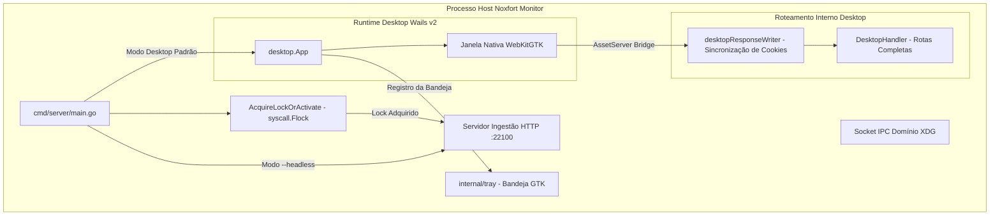

# 🖥️ Aplicação Desktop e Operações (Wails v2 & Headless)

Este documento detalha a arquitetura desktop nativa do **Noxfort Monitor™ v2.0**, construída com **Wails v2** e **WebKitGTK**, trava atômica de instância única a nível de kernel via `syscall.Flock`, integração com a bandeja do sistema (Systray) e execução em modo servidor daemon (`--headless`).

⬅️ [Central de Documentação](../README.md) | 🏛️ [Arquitetura](architecture.md) | 🚀 [Deploy](deployment.md)

---

## 1. Arquitetura Wails v2

Em substituição a runtimes pesados baseados em Chromium/Electron, o Noxfort Monitor utiliza o **Wails v2** integrado com **WebKitGTK** nativo do Linux:



### Especificações Técnicas:
* **Dimensões Padrão**: 1280x800 px (mínimo de 1024x600 px).
* **Política de GPU**: `linux.WebviewGpuPolicyOnDemand` para economia energética em estações de trabalho industriais.
* **Minimizar ao Fechar**: `HideWindowOnClose: true`. Clicar no botão fechar ("X") oculta a interface para a bandeja sem encerrar os serviços em segundo plano.

---

## 2. Trava Atômica de Instância Única (Flock & IPC)

Para prevenir conflitos de portas de rede (MQTT `:1883`, HTTP `:22100`) e corrupção de banco de dados, o monitor utiliza uma trava dupla robusta ([`internal/desktop/singleinstance.go`](../../internal/desktop/singleinstance.go)):

1. **Flock Atômico no Kernel (`syscall.Flock`) via `AcquireLockOrActivate()`**:
   - Cria e adquire um lock exclusivo não-bloqueante (`LOCK_EX | LOCK_NB`) em `$XDG_RUNTIME_DIR/noxfort-monitor.lock` (ou `/tmp/noxfort-monitor-<uid>.lock`).
   - Se outra instância já estiver ativa, o kernel retorna erro imediatamente. O novo processo chama `desktop.TryActivateExisting()` e finaliza com código `0`.
2. **Socket IPC Unix Dinâmico**:
   - A instância primária escuta em `$XDG_RUNTIME_DIR/noxfort-monitor.sock`.
   - Invocações subsequentes enviam o comando `ACTIVATE` pelo socket. A instância ativa recebe o comando e restaura sua janela para o primeiro plano via `desktopApp.RestoreWindow()`.

---

## 3. Modo Servidor Headless (`--headless`)

Para servidores em nuvem ou ambientes sem interface gráfica (X11 / Wayland):
```bash
./bin/noxfort-monitor --headless
# Ou via Makefile:
make run-headless
```

### Comportamento em Modo Headless:
1. **Desativa GUI**: Bypassa a inicialização de janelas Wails v2 e WebKitGTK.
2. **Servidor HTTP Restrito**: Executa o `ExternalIngestionHandler` na porta `22100`, atendendo exclusivamente requisições de sensores (`POST /api/telemetry`).
3. **Bloqueio de Navegador (403)**: Acessos via browser ao dashboard são bloqueados por segurança. O nó opera como coletor autônomo de telemetria e despachador de alertas.
4. **Shutdown Gracioso**: Bloqueia aguardando sinais de término do SO (`SIGINT`, `SIGTERM`), liberando locks atômicos ao encerrar.
