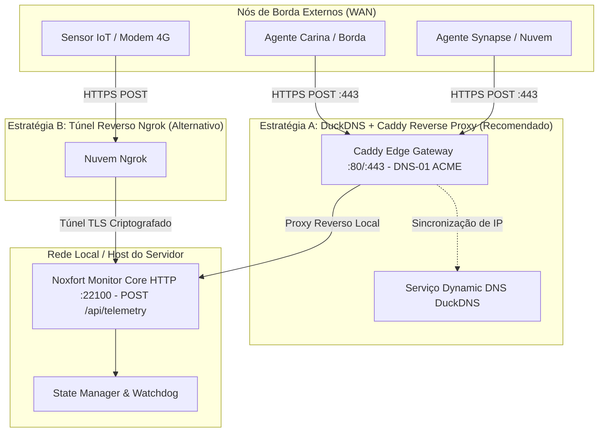

# 🌐 Acesso Remoto e Ingestão WAN (DuckDNS & Ngrok)

Este documento detalha a arquitetura de comunicação em rede de longa distância (WAN) do **Noxfort Monitor™ v2.0**, cobrindo a sincronização dinâmica via **DuckDNS**, terminação TLS automatizada com **Caddy Server**, e suporte alternativo a túnel reverso via **Ngrok** para ingestão de telemetria de nós externos (**Carina**, **Synapse**, sensores IoT).

⬅️ [Central de Documentação](../README.md) | 🏛️ [Arquitetura](architecture.md) | 📡 [API](api_reference.md) | 🚀 [Deploy](deployment.md)

---

## 1. Estratégias de Acesso WAN

O Noxfort Monitor adota duas estratégias complementares para transposição de redes:



1. **DuckDNS + Caddy (Padrão Ativo)**:
   - Sincroniza dinamicamente o subdomínio (`seu-subdominio.duckdns.org`) com o IP público da máquina.
   - O [Caddy Server](../CADDY_INTEGRATION.md) obtém certificados TLS/SSL válidos automaticamente via desafio **ACME DNS-01** (sem exigir porta 80 aberta).
   - Centraliza o tráfego externo nas portas padrão 80 e 443.
2. **Túnel Ngrok (Alternativa para CGNAT Estrito)**:
   - Estabelece conexão de saída TLS criptografada para ambientes onde não há permissão para redirecionamento de portas no roteador.

---

## 2. Arquitetura do Driver (`internal/tunnel`)

O pacote `internal/tunnel` implementa o Princípio da Inversão de Dependências (DIP):
```go
type Service interface {
    Start(authToken, domain string) error
    Stop() error
    GetStatus() Status
    IsBinaryAvailable() bool
    TestConnection(ctx context.Context, token, domain string) (*TestResult, error)
}
```

* **`DuckDNSDriver`**: Atualiza os registros do DuckDNS via API HTTP, detecta endereços IPv6 ativos e executa testes de diagnóstico de resolução DNS em tempo real (`POST /api/tunnel/test`).
* **`NgrokDriver`**: Gerencia o processo binário do cliente Ngrok e monitora túneis ativos.
* **Persistência**: Credenciais salvas no banco de dados nas colunas `duckdns_token`, `duckdns_domain`, `duckdns_enabled` e equivalentes do Ngrok.
* **Operações de API**:
  * `GET /api/tunnel/status`: Retorna estado, provedor, URLs públicas e IPv6.
  * `POST /api/tunnel/save`: Salva credenciais do DuckDNS / Ngrok.
  * `POST /api/tunnel/start`: Dispara atualização ou abre túnel.
  * `POST /api/tunnel/stop`: Pausa o serviço e desativa inicialização automática.
  * `POST /api/tunnel/disconnect`: Remove credenciais e desliga o serviço.
  * `POST /api/tunnel/test`: Validação ativa de credenciais e resolução DNS.
