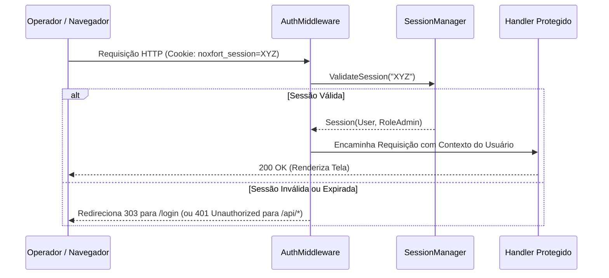

# 🔐 Segurança, Autenticação e Controle de Acesso (RBAC)

Este documento detalha a arquitetura de segurança do **Noxfort Monitor™ v2.0**, incluindo autenticação, ciclo de vida de tokens de sessão, hash de senhas com sal criptográfico e Controle de Acesso Baseado em Papéis (RBAC).

⬅️ [Central de Documentação](../README.md) | 🏛️ [Arquitetura](architecture.md) | 🔍 [Trilha de Auditoria](audit_trail.md) | 📡 [API](api_reference.md)

---

## 1. Arquitetura de Segurança e RBAC

O Noxfort Monitor implementa segregação rígida de privilégios:

* **`RoleAdmin` ("ADMIN")**: Privilégios totais de administração: cadastro de usuários, migração de bancos de dados, abertura de túnel reverso e configurações gerais do sistema.
* **`RoleOperator` ("OPERATOR")**: Privilégios operacionais: visualização do painel de telemetria, listagem de equipamentos e histórico de alertas.
* **Papéis de Roteamento de Notificações**:
  * **`TECHNICIAN`**: Recebe exclusivamente incidentes da categoria `HARDWARE`.
  * **`PROGRAMMER`**: Recebe exclusivamente incidentes da categoria `SOFTWARE`.
  * **`ADMIN`**: Recebe todas as categorias de incidentes.

---

## 2. Hash Criptográfico de Senhas e Sal Único

As senhas são protegidas por derivação SHA-256 com sal criptográfico em `internal/security/hasher.go`:
* Sal aleatório de 16 bytes gerado individualmente por usuário.
* Senhas e hashes são estritamente excluídos da serialização JSON (`json:"-"`).
* Comparação em tempo constante para evitar ataques de temporização (*timing attacks*).

---

## 3. Ciclo de Vida da Sessão e AuthMiddleware

* **Armazenamento**: Mapa thread-safe em memória sincronizado por mutex.
* **Renovação Deslizante**: Interações ativas renovam automaticamente a janela de validade de 24 horas.
* **Intercepção Inteligente**: Requisições web sem sessão são redirecionadas com código HTTP `303 See Other`; chamadas para a API REST retornam JSON `401 Unauthorized`.

---

## 4. Hardening do Broker MQTT e Senhas PBKDF2

* **Desativação de Acesso Anônimo**: [`mosquitto.conf`](../../mosquitto/config/mosquitto.conf) define `allow_anonymous false`.
* **Criptografia Forte**: Credenciais geradas via `mosquitto_passwd` com hash PBKDF2 (SHA-512).
* **Setup Automatizado**: Comando `make broker-auth` gera credenciais e sincroniza automaticamente no `.env`.
* **Proteção Git**: Arquivos `passwd*` são ignorados no repositório.

---

## 5. Validação de Segurança de Ambiente (`env_validator.go`)

No boot do sistema, o validador inspeciona a integridade das configurações locais:
* **Restrição Automática de Permissões (`0600`)**: Em ambientes Linux, restringe o arquivo `.env` para leitura exclusiva pelo proprietário caso esteja acessível publicamente.
* **Detecção de Senhas Fracas**: Emite alerta crítico caso `admin/admin` permaneça ativo em produção.

---

## 6. Prevenção de Vazamento de Segredos no CI/CD

O workflow automatizado do GitHub Actions ([`.github/workflows/ci.yml`](../../.github/workflows/ci.yml)) audita todo commit para impedir o versionamento de arquivos `.env`, chaves privadas (`*.pem`, `*.key`) ou senhas do Mosquitto.
