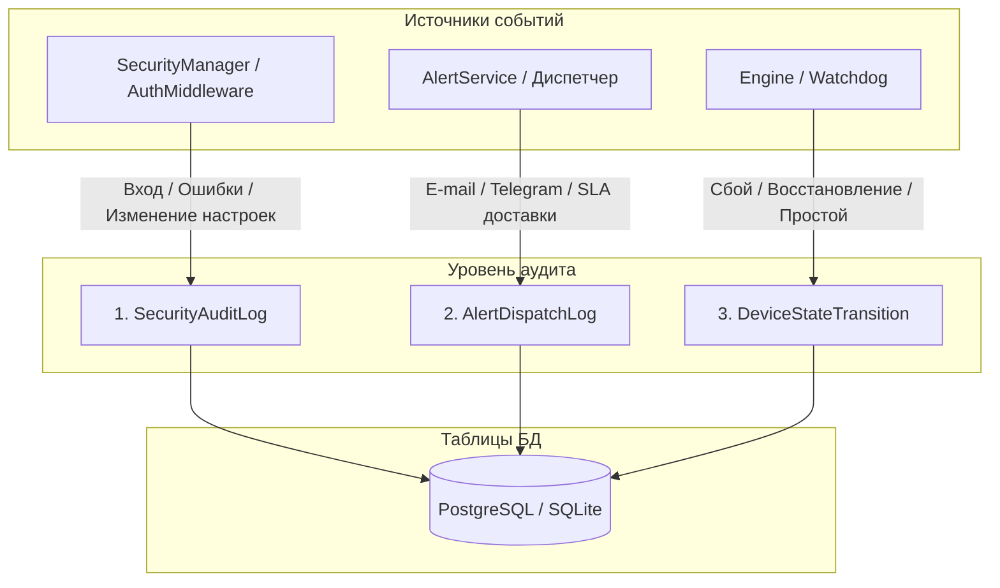

# 🔍 Аудиторский след и наблюдаемость

Данный документ описывает подсистему аудита и соответствия требованиям **Noxfort Monitor™ v2.0**, включая регистрацию действий безопасности, контроль SLA доставки тревог и фиксацию времени простоя оборудования.

⬅️ [Главный Хаб](../README.md) | 🏛️ [Архитектура](architecture.md) | 🔐 [Безопасность](security.md)

---

## 1. Архитектура тройного аудита

Noxfort Monitor разделяет записи аудита на три независимых неизменяемых потока:

---

## 2. Модели и спецификация полей

### 2.1 `SecurityAuditLog`
Фиксирует попытки авторизации, смену паролей и административные действия:
* `id` (*int64*): Уникальный последовательный номер.
* `action` (*string*): `LOGIN_SUCCESS`, `LOGIN_FAILED`, `CONFIG_UPDATE`, `USER_CREATE`.
* `username` (*string*): Имя пользователя, выполнившего действие.
* `ip_address` (*string*): IP-адрес клиента.
* `user_agent` (*string*): Идентификатор браузера или клиента.
* `created_at` (*timestamp*): Время события в формате UTC.

### 2.2 `AlertDispatchLog`
Обеспечивает подтверждение доставки сообщений для контроля SLA:
* `incident_id` (*int64*): Ссылка на породивший инцидент телеметрии.
* `contact_id` (*int64*): Идентификатор получателя.
* `channel` (*string*): `EMAIL` или `TELEGRAM`.
* `status` (*string*): `SENT` или `FAILED`.
* `error_message` (*string*): Описание ошибки при сетевом сбое.
* `dispatched_at` (*timestamp*): Время попытки отправки.

### 2.3 `DeviceStateTransition`
Отслеживает доступность оборудования и фиксирует общее время простоя:
* `device_id` (*int64*): Идентификатор контролируемого узла.
* `from_state` (*string*): `ONLINE` / `OFFLINE`.
* `to_state` (*string*): `OFFLINE` / `ONLINE`.
* `transitioned_at` (*timestamp*): Время фиксации изменения статуса.
* `downtime_seconds` (*int64*): Суммарное время недоступности в секундах.
