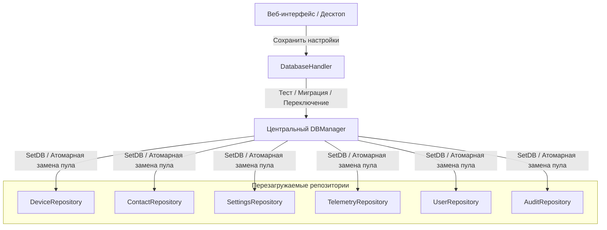

# 🗄️ База данных и двухдвижковая персистентность

Данный документ описывает слой хранения данных **Noxfort Monitor™ v2.0**, включая одновременную поддержку PostgreSQL и SQLite, динамический менеджер переключения (`DBManager`), автоматическую миграцию и адаптер SQL-диалектов.

⬅️ [Главный Хаб](../README.md) | 🏛️ [Архитектура](architecture.md) | 📡 [API](api_reference.md) | 🔐 [Безопасность](security.md)

---

## 1. Сосуществование двух СУБД

Noxfort Monitor рассчитан как на автономные локальные узлы, так и на корпоративные отказоустойчивые кластеры:

| Параметр | SQLite (Чистый Go) | PostgreSQL |
|---|---|---|
| **Go-драйвер** | `modernc.org/sqlite` (без CGO) | `github.com/lib/pq` |
| **Сценарий** | Локальные рабочие места, периферийные узлы | Промышленные серверы, высокая нагрузка |
| **Файл / Хост** | `~/Documentos/Monitor/monitor_logs.db` | TCP-сервер (порт `5432`) |
| **Изоляция** | Локальный файл БД | Выделенная схема (`schema_monitor`) |
| **Зависимости** | Нет (встроен в бинарный файл) | Сетевой сервер PostgreSQL 12+ |

---

## 2. Горячая перезагрузка (`DBManager`)

Компонент `DBManager` выполняет переключение базы данных во время работы без перезапуска процесса и без сброса активных сессий:



Все репозитории реализуют интерфейс `ReloadableRepository`:
```go
type ReloadableRepository interface {
    SetDB(db *sql.DB)
}
```

---

## 3. Автоматическая миграция (`MigrateData`)

При смене движка между SQLite и PostgreSQL процедура `MigrateData()` обеспечивает полную целостность:
1. Открывает параллельные подключения к исходной и целевой базам.
2. Извлекает оборудование, контакты, пользователей, настройки и историю инцидентов.
3. Выполняет операции upsert с вызовом `storage.AdaptQuery()` для адаптации синтаксиса (`ON CONFLICT (id) DO UPDATE`).
4. Перенаправляет репозитории на новую базу и фиксирует конфигурацию на диске.
