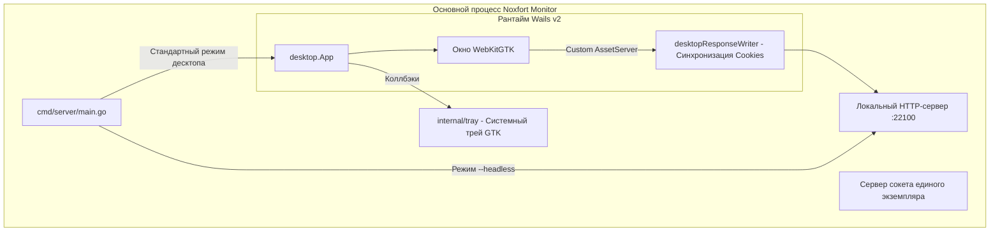

# 🖥️ Десктопное приложение и режимы работы (Wails v2 & Headless)

Данный документ описывает десктопную архитектуру **Noxfort Monitor™ v2.0**, разработанную с применением **Wails v2** и **WebKitGTK**, блокировку повторного запуска через сокет Unix, системный трей и работу в режиме сервиса (`--headless`).

⬅️ [Главный Хаб](../README.md) | 🏛️ [Архитектура](architecture.md) | 🚀 [Развертывание](deployment.md)

---

## 1. Архитектура Wails v2

Вместо ресурсоемких движков на базе Chromium/Electron Noxfort Monitor использует **Wails v2** со встроенным в Linux **WebKitGTK**:



### Технические параметры:
* **Разрешение окна**: 1280x800 px (минимум 1024x600 px).
* **Политика GPU**: `linux.WebviewGpuPolicyOnDemand`.
* **Сворачивание при закрытии**: `HideWindowOnClose: true`. Нажатие на кнопку закрытия сворачивает окно в трей, не прерывая работу сервера.

---

## 2. Блокировка единого экземпляра (Unix IPC Socket)

Для предотвращения конфликтов портов (MQTT `:1883`, HTTP `:22100`):
1. `desktop.TryActivateExisting()` опрашивает сокет `/tmp/noxfort-monitor-singleinstance.sock`.
2. Если процесс уже запущен, отправляется команда `ACTIVATE`, и новый процесс немедленно завершается с кодом `0`.
3. Работающий экземпляр получает команду, разворачивает окно из трея и выводит его на передний план.

---

## 3. Серверный режим (`--headless`)

Для облачных серверов и систем без графической оболочки (X11 / Wayland):
```bash
./bin/noxfort-monitor --headless
# Либо через Makefile:
make run-headless
```
В данном режиме инициализация GUI пропускается, а процесс переходит в ожидание системных сигналов (`SIGINT`, `SIGTERM`).
