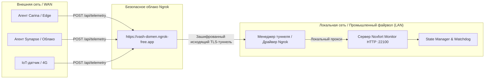

# 🌐 Удаленный доступ и WAN-телеметрия (Туннель Ngrok)

Данный документ описывает сетевую архитектуру глобального подключения (WAN) **Noxfort Monitor™ v2.0**, включая обратный туннель через **Ngrok**, преодоление промышленных файрволов и CGNAT, а также прием данных от внешних агентов (**Carina**, **Synapse**).

⬅️ [Главный Хаб](../README.md) | 🏛️ [Архитектура](architecture.md) | 📡 [API](api_reference.md) | 🚀 [Развертывание](deployment.md)

---

## 1. Зачем нужен обратный туннель?

В промышленной среде центральный сервер мониторинга часто располагается внутри локальной сети (LAN), за маршрутизаторами с NAT, сотовыми шлюзами с CGNAT или корпоративными файрволами без возможности проброса входящих портов.



Благодаря установке защищенного **исходящего** TLS-соединения к сервису Ngrok сервер получает публичный адрес в интернете без белого IP и без открытия портов наружу.

---

## 2. Архитектура драйвера (`internal/tunnel`)

Пакет `internal/tunnel` использует Принцип Инверсии Зависимостей (DIP):
```go
type Service interface {
    Start(authToken, domain string) error
    Stop() error
    GetStatus() Status
    IsBinaryAvailable() bool
}
```

* **`NgrokDriver`**: Управляет бинарным процессом клиента Ngrok, считывает назначенный публичный URL из стандартного потока вывода и контролирует статус туннеля.
* **Статические домены**: Поддержка фиксированных доменных имен исключает необходимость перенастройки датчиков после перезагрузки сервера.
