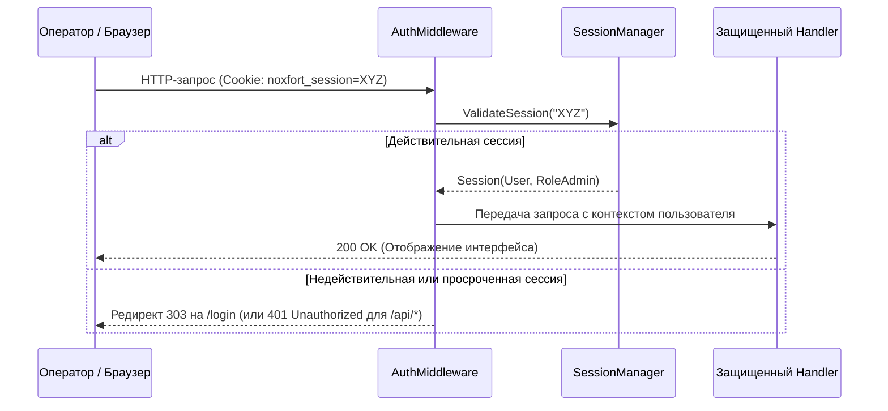

# 🔐 Безопасность, аутентификация и контроль доступа (RBAC)

Данный документ описывает систему безопасности **Noxfort Monitor™ v2.0**, включая проверку подлинности, жизненный цикл сессионных токенов, хеширование паролей с солью и ролевую модель (RBAC).

⬅️ [Главный Хаб](../README.md) | 🏛️ [Архитектура](architecture.md) | 🔍 [Аудит](audit_trail.md) | 📡 [API](api_reference.md)

---

## 1. Ролевая модель доступа (RBAC)

Noxfort Monitor обеспечивает строгое разграничение привилегий:

* **`RoleAdmin` ("ADMIN")**: Полные административные права: управление учетными записями, миграция БД, управление туннелем и системными параметрами.
* **`RoleOperator` ("OPERATOR")**: Операторские права: просмотр мониторинга, списка оборудования и журнала инцидентов.
* **Роли маршрутизации оповещений**:
  * **`TECHNICIAN`**: Получает исключительно инциденты категории `HARDWARE`.
  * **`PROGRAMMER`**: Получает исключительно инциденты категории `SOFTWARE`.
  * **`ADMIN`**: Получает все оповещения системы.

---

## 2. Хеширование с криптографической солью

Пароли защищаются с помощью функции SHA-256 с уникальной солью в `internal/security/hasher.go`:
* Для каждого пользователя генерируется уникальная случайная 16-байтная соль.
* Пароли и их хеши исключены из сериализации в JSON (`json:"-"`).
* Сравнение за константное время предотвращает тайминг-атаки (*timing attacks*).

---

## 3. Жизненный цикл сессий и AuthMiddleware

* **Хранение в памяти**: Потокобезопасная хеш-таблица с мьютексом.
* **Плавающее продление**: Активность пользователя автоматически продлевает сессию на 24 часа.
* **Разделение ответов**: Неавторизованные запросы к веб-интерфейсу перенаправляются на `/login` (код `303`), а вызовы API возвращают `401 Unauthorized`.
