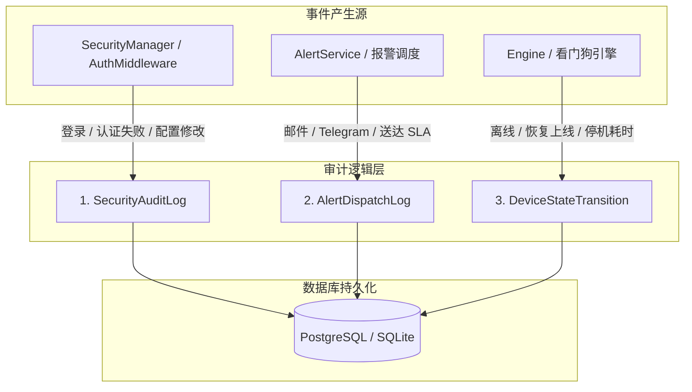

# 🔍 审计追踪与系统可观测性

本文档详细规范 **Noxfort Monitor™ v2.0** 的审计与合规子系统，涵盖安全访问留痕、告警推送 SLA 追溯及设备故障停机时间统计。

⬅️ [文档中心](../README.md) | 🏛️ [系统架构](architecture.md) | 🔐 [安全规范](security.md)

---

## 1. 三重审计存储架构

Noxfort Monitor 将审计记录清晰划分为三条不可篡改的持久化数据流：

---

## 2. 核心数据模型与字段规范

### 2.1 `SecurityAuditLog`（安全访问审计）
记录所有身份鉴权尝试、凭据变更与管理操作：
* `id` (*int64*): 自增唯一序列号。
* `action` (*string*): 操作动作 (`LOGIN_SUCCESS`, `LOGIN_FAILED`, `CONFIG_UPDATE`, `USER_CREATE`)。
* `username` (*string*): 发起操作的用户账号。
* `ip_address` (*string*): 远程访问客户端 IP 地址。
* `user_agent` (*string*): 客户端环境标识字符串。
* `created_at` (*timestamp*): 记录创建的 UTC 时间戳。

### 2.2 `AlertDispatchLog`（报警履约审计）
为事故调查及服务等级协议 (SLA) 提供确凿的司法证据：
* `incident_id` (*int64*): 关联的遥测告警事件引用。
* `contact_id` (*int64*): 接收人联系方式编号。
* `channel` (*string*): `EMAIL` 或 `TELEGRAM`。
* `status` (*string*): `SENT` (已送达) 或 `FAILED` (发送失败)。
* `error_message` (*string*): 网络异常时的详细错误日志。
* `dispatched_at` (*timestamp*): 发送尝试的精确时间戳。

### 2.3 `DeviceStateTransition`（设备状态跳变日志）
实时追踪现场硬件运行状态并计算累计中断时长：
* `device_id` (*int64*): 受监控设备节点编号。
* `from_state` (*string*): `ONLINE` / `OFFLINE`。
* `to_state` (*string*): `OFFLINE` / `ONLINE`。
* `transitioned_at` (*timestamp*): 状态转移被检测到的时刻。
* `downtime_seconds` (*int64*): 设备重新上线时结算的累计故障停机秒数。
