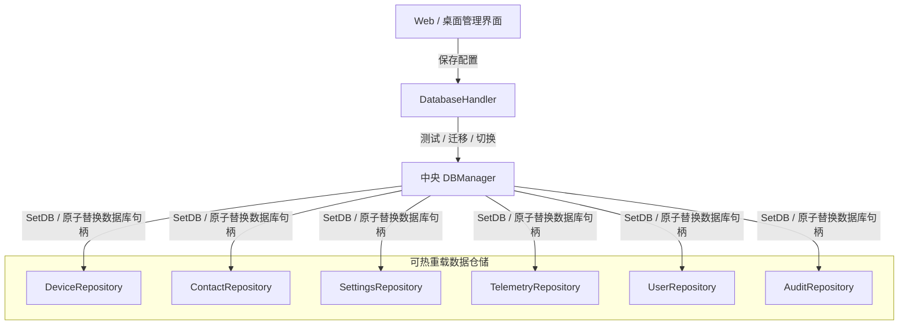

# 🗄️ 数据库架构与双引擎持久化机制

本文档详细说明 **Noxfort Monitor™ v2.0** 的双引擎持久化层设计，包括 PostgreSQL 与 SQLite 的协同运作、运行时热切换管理器 (`DBManager`)、自动化异构数据迁移及 SQL 方言转换。

⬅️ [文档中心](../README.md) | 🏛️ [系统架构](architecture.md) | 📡 [API 规范](api_reference.md) | 🔐 [安全规范](security.md)

---

## 1. 双数据库引擎共存设计

Noxfort Monitor 同时兼顾轻量级单机边缘部署与企业级高可用集群环境：

| 维度对比 | SQLite (纯 Go 实现) | PostgreSQL |
|---|---|---|
| **Go 驱动库** | `modernc.org/sqlite` (无需 CGO) | `github.com/lib/pq` |
| **应用场景** | 单机工作站、轻量化边缘节点 | 高并发企业服务器、分布式集群 |
| **存储位置** | `~/Documentos/Monitor/monitor_logs.db` | TCP 网络服务器 (端口 `5432`) |
| **隔离级别** | 单本地数据库文件 | 专属模式命名空间 (`schema_monitor`) |
| **运行依赖** | 零外部依赖（静态编译进二进制） | 外部网络 PostgreSQL 12+ 实例 |

---

## 2. 动态热切换机制 (`DBManager`)

`DBManager` 负责在不停机、不中断客户端请求的前提下平滑切换底层持久化引擎：



系统内所有仓储均实现了 `ReloadableRepository` 接口：
```go
type ReloadableRepository interface {
    SetDB(db *sql.DB)
}
```

---

## 3. 异构无损数据迁移 (`MigrateData`)

在 SQLite 与 PostgreSQL 之间切换时，`MigrateData()` 保障数据零丢失：
1. 并发建立源数据库与目标数据库的活动连接。
2. 批量导出设备、联系人、用户、配置及遥测历史记录。
3. 利用 `storage.AdaptQuery()` 统一处理方言冲突（如 `ON CONFLICT (id) DO UPDATE`）。
4. 切换所有仓储引用至新数据库并将配置持久化至磁盘。
