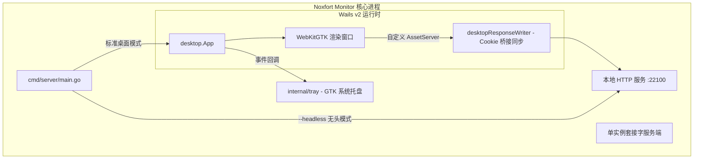

# 🖥️ 桌面应用架构与运维模式 (Wails v2 与 Headless)

本文档剖析 **Noxfort Monitor™ v2.0** 的桌面技术体系，涵盖基于 **Wails v2** 与 **WebKitGTK** 的混合桌面运行时、Unix IPC 套接字单实例锁、系统托盘管理及无头服务端守护模式。

⬅️ [文档中心](../README.md) | 🏛️ [系统架构](architecture.md) | 🚀 [部署指南](deployment.md)

---

## 1. Wails v2 桌面运行时

摒弃体积庞大的 Chromium/Electron 框架，Noxfort Monitor 采用 **Wails v2** 与 Linux 原生 **WebKitGTK** 深度整合：



### 关键技术规范：
* **窗口默认尺寸**：1280x800 px（最小支持 1024x600 px）。
* **显卡节能策略**：`linux.WebviewGpuPolicyOnDemand`，最大化降低工控机能耗。
* **关闭即最小化**：`HideWindowOnClose: true`。点击窗口关闭按钮 ("X") 时将界面收起至系统托盘，后台服务协程保持不间断运作。

---

## 2. 单实例排他性机制 (Unix IPC Socket)

为避免网络端口冲突（MQTT `:1883`, HTTP `:22100`）：
1. `desktop.TryActivateExisting()` 探测 `/tmp/noxfort-monitor-singleinstance.sock`。
2. 若已有运行中的进程，新实例发送 `ACTIVATE` 指令并立即正常退出（退出码 `0`）。
3. 已运行的实例接收到信号后，从托盘还原主窗口并将其置于桌面最前端。

---

## 3. 无头服务端模式 (`--headless`)

针对云主机或无图形界面环境（X11 / Wayland）：
```bash
./bin/noxfort-monitor --headless
# 或通过 Makefile 快捷启动:
make run-headless
```
该模式跳过所有 GTK/Wails 界面初始化，主 Goroutine 挂起监听操作系统终止信号 (`SIGINT`, `SIGTERM`)。
