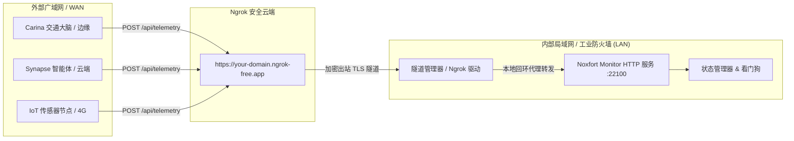

# 🌐 远程访问与广域网遥测接入 (Ngrok 隧道)

本文档详细说明 **Noxfort Monitor™ v2.0** 的广域网 (WAN) 通信架构，涵盖基于 **Ngrok** 的反向隧道子系统、工业内网防火墙及运营商 CGNAT 穿透方案。

⬅️ [文档中心](../README.md) | 🏛️ [系统架构](architecture.md) | 📡 [API 规范](api_reference.md) | 🚀 [部署指南](deployment.md)

---

## 1. 为什么工业现场需要反向隧道？

在工业物联与分布式监控场景中，中心监控服务器通常部署在局域网内部，处于 NAT 路由器、4G/5G 运营商 CGNAT 或严苛的企业内网防火墙之后，无法配置公网端口映射。



通过建立向外的加密 TLS 出站长连接，Noxfort Monitor 无需公网固定 IP 即可安全接收互联网发来的遥测报文。

---

## 2. 驱动抽象层设计 (`internal/tunnel`)

隧道子系统严格遵循依赖倒置原则 (DIP)：
```go
type Service interface {
    Start(authToken, domain string) error
    Stop() error
    GetStatus() Status
    IsBinaryAvailable() bool
}
```

* **`NgrokDriver`**：负责管理本地 Ngrok 客户端进程，实时解析标准输出日志捕获分配的公网 URL，并提供连接心跳检测。
* **支持静态保留域名**：支持绑定企业固定的二级域名，确保现场传感器在监控服务重启后无需更新上报配置。
