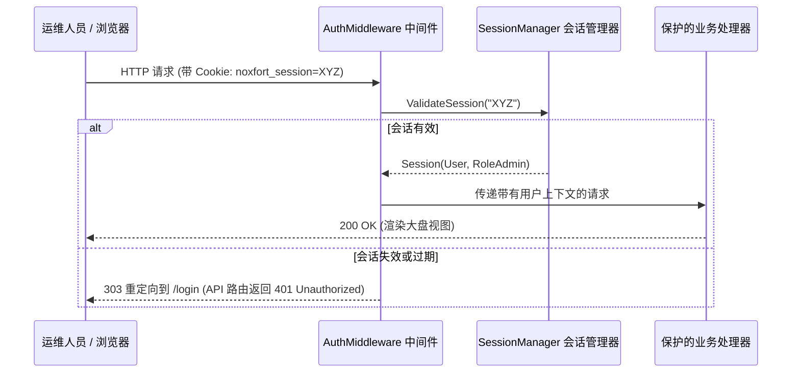

# 🔐 系统安全、身份认证与基于角色的访问控制 (RBAC)

本文档深入阐述 **Noxfort Monitor™ v2.0** 的安全体系结构，包括用户身份校验、会话令牌生命周期、加盐密码散列及基于角色的访问控制 (RBAC)。

⬅️ [文档中心](../README.md) | 🏛️ [系统架构](architecture.md) | 🔍 [审计追踪](audit_trail.md) | 📡 [API 规范](api_reference.md)

---

## 1. 角色定义与权限隔离

Noxfort Monitor 实行严格的最小权限分级制度：

* **`RoleAdmin` ("ADMIN")**：系统超级管理员。拥有用户增删改查、数据库迁移热切、反向穿透隧道控制及全局设置权限。
* **`RoleOperator` ("OPERATOR")**：运维操作人员。拥有监控大盘查看、设备在线状态监控及告警历史调阅权限。
* **报警通知分发角色**：
  * **`TECHNICIAN`**：仅接收 `HARDWARE` 硬件故障报警。
  * **`PROGRAMMER`**：仅接收 `SOFTWARE` 软件故障报警。
  * **`ADMIN`**：接收全量系统报警。

---

## 2. 独立加盐密码散列

所有用户凭据均在 `internal/security/hasher.go` 中通过带有独占随机盐的 SHA-256 算法进行保护：
* 为每个用户独立生成 16 字节的安全随机盐。
* 密码原明文与散列值均被彻底排除在 JSON 序列化字段之外 (`json:"-"`)。
* 采用恒定时间比对算法抵御时序侧信道攻击。

---

## 3. 会话机制与 AuthMiddleware 中间件

* **内存线程安全存储**：基于带读写互斥锁的哈希表管理。
* **滑动窗口续期**：活动用户请求会自动将 24 小时过期窗口后移。
* **区分式拦截响应**：未鉴权的 Web 页面请求以 HTTP `303 See Other` 重定向至登录页；REST API 调用则返回 `401 Unauthorized`。
